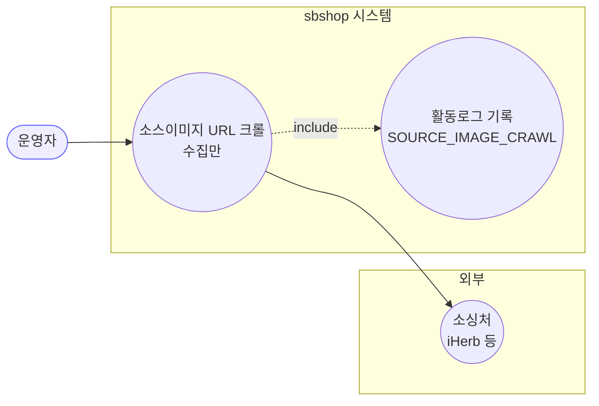
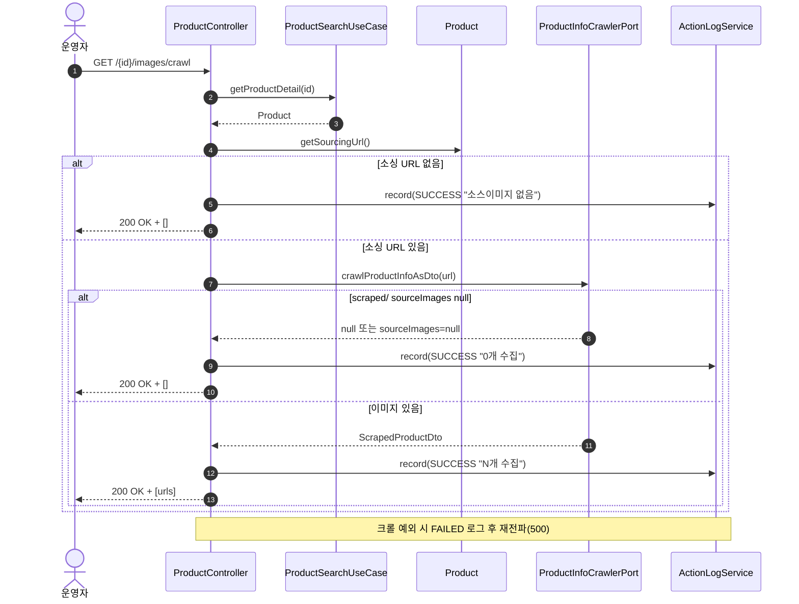

# GET /{id}/images/crawl — 소싱처 소스이미지 URL 크롤(수집만)

## 1. 개요

| 항목 | 내용 |
|------|------|
| **Method / URL** | `GET /api/v1/products/{id}/images/crawl` |
| **목적** | 상품의 소싱 URL 을 크롤하여 소스이미지 URL 목록을 **수집만** 해 반환한다(저장·업로드·마켓 전송 없음). 미리보기/선택용. |
| **핵심 상태전이** | 없음(순수 조회 + 외부 크롤) |
| **부수효과** | **외부 소싱처 크롤(읽기)** + 활동로그(P6, `SOURCE_IMAGE_CRAWL`). 자사 DB/마켓 변경 없음. |
| **응답** | `200 OK` + `List<String>`(이미지 URL) |

**경로 파라미터**

| 파라미터 | 타입 | 필수 | 비고 |
|----------|------|------|------|
| `id` | Long | ✅ | 상품 PK |

## 2. 호출 체인

```
ProductController.crawlSourceImages()              api/.../controller/ProductController.java:157-182
  └─ [try]
  │   ├─ ProductSearchUseCase.getProductDetail(id) → Product  ProductController.java:163
  │   │     └─ ProductReader.findById() orElseThrow  core/.../product/ProductSearchUseCase.java:25-28
  │   ├─ product.getSourcingUrl()                   core/.../domain/product/Product.java:321-323 (SourcingInfo.sourceUrl)
  │   ├─ [sourcingUrl null/empty] → record(SUCCESS "소스이미지 없음") + return []  ProductController.java:165-169
  │   ├─ ProductInfoCrawlerPort.crawlProductInfoAsDto(sourcingUrl)  core/.../product/port/ProductInfoCrawlerPort.java:7  → ScrapedProductDto
  │   ├─ images = (scraped==null || scraped.sourceImages()==null) ? [] : scraped.sourceImages()  ProductController.java:171-172
  │   └─ record(SOURCE_IMAGE_CRAWL, null, SUCCESS, "...개 수집") + return images  ProductController.java:173-176
  └─ [catch] record(..., FAILED, ...); throw  ProductController.java:177-181
```

## 3. 유스케이스 다이어그램



> **관찰:** 마켓 전송·자사 저장 없이 외부 소싱처만 읽는 유일한 상품 크롤 API(대응 쓰기 경로는 `crawl-and-upload`).

## 4. 시퀀스 다이어그램



## 5. 순서도 (플로우차트)

```mermaid
flowchart TD
    START([GET /images/crawl]) --> FIND{getProductDetail 성공?}
    FIND -- No --> ERR1[예외 → FAILED 로그 → 500]:::err
    FIND -- Yes --> URL{"sourcingUrl<br/>null/empty?"}
    URL -- Yes --> EMPTY[SUCCESS 로그<br/>소스이미지 없음]:::warn
    EMPTY --> OKE([200 OK + list()]):::ok
    URL -- No --> CRAWL[crawlProductInfoAsDto]
    CRAWL --> NULL{"scraped/sourceImages<br/>null?"}
    NULL -- Yes --> ZERO[images=list()]:::warn
    NULL -- No --> HAVE[images=sourceImages]
    ZERO --> LOG[SUCCESS 로그 N개]
    HAVE --> LOG
    LOG --> OK([200 OK + images]):::ok

    classDef err fill:#fdd,stroke:#c33;
    classDef ok fill:#dfd,stroke:#3a3;
    classDef warn fill:#fe8,stroke:#e90;
```

## 6. 상태 전이표

상품 상태 전이 없음. **크롤 결과 분기** 표.

| 조건 | 활동로그 | 응답 |
|------|----------|------|
| 소싱 URL 없음 | SUCCESS "소스이미지 없음" | 200 + `[]` |
| 크롤 결과 null/이미지 null | SUCCESS "0개 수집" | 200 + `[]` |
| 이미지 수집 성공 | SUCCESS "N개 수집" | 200 + `[urls]` |
| 크롤 예외 | FAILED "크롤 실패" | 500(재전파) |

## 7. 🔎 발견사항

### F-PROD-17 · 🔵 NOTE — 빈결과와 크롤실패를 명시적으로 구분(잘 설계된 지점)
- **근거:** `ProductController.java:161`·`165-169`·`171-176` — 소싱 URL 없음/크롤 0개를 각각 SUCCESS 로그로 "왜 비었는지" 남기고, 예외만 FAILED 로 분리한다. 주석(160-161)이 의도를 명시.
- **영향:** 사용자가 "이미지가 왜 안 나오는지" 활동로그로 진단 가능. 다른 크롤 API 의 참고 모범.
- **제안:** 유지. 다만 응답 자체는 빈 배열이라 프론트는 로그를 봐야 이유를 앎 — 사유를 응답에도 실을지 검토(선택).

### F-PROD-18 · 🟠 GAP — 크롤 결과 이미지 URL 유효성/중복 검증 없음(3경로 공통 소스)
- **근거:** `ProductController.java:170-172` — `scraped.sourceImages()`를 그대로 반환. 각 URL 의 스킴/도달성/중복 제거 없음. 동일 소스가 `crawl-and-upload`(195-197)에서 그대로 `downloadAndConvert`로 흘러 다운로드된다.
- **영향:** 깨진/중복 URL 이 그대로 미리보기에 노출되고, crawl-and-upload 경로에서 다운로드 실패(F-PROD-16)로 이어질 수 있다.
- **제안:** 크롤러 어댑터 또는 컨트롤러에서 URL 정규화·중복 제거 추가 검토.

### F-PROD-19 · 🟡 SMELL — 크롤 로직(소싱URL 확인 + crawl + null 가드)이 `crawl-and-upload`와 중복
- **근거:** `ProductController.java:163-172`(GET crawl)과 `187-197`(POST crawl-and-upload)이 "getProductDetail → getSourcingUrl → 없으면 빈결과 → crawlProductInfoAsDto → null 가드"를 거의 동일하게 반복한다.
- **영향:** 크롤 파싱 규칙 변경 시 두 곳 동기화 필요.
- **제안:** "id → 소스이미지 URL 목록" 공통 프라이빗 메서드로 추출하고, 두 엔드포인트가 재사용. `crawl-and-upload`는 그 결과를 업로드 파이프라인에 넘기기만.

## 8. 테스트 커버리지 메모

- **존재:** `ProductControllerActionLogDetailTest`(api)
  - `crawlSourceImages_recordsSuccess`: 이미지 수집 성공 시 `SOURCE_IMAGE_CRAWL` SUCCESS 로그.
  - `crawlSourceImages_recordsEmptyWhenNoSourcingUrl`: 소싱 URL 없을 때 결과 없음 로그.
- **비어있는 케이스:**
  - `crawlProductInfoAsDto`가 null 반환 시 빈배열 경로(`ProductController.java:171`) → 미검증.
  - 크롤 예외 시 FAILED 로그 후 재전파 → 미검증.
  - 반환 URL 유효성/중복(F-PROD-18) → 미검증.

---
*생성: 2026-07-14 · 근거 커밋: main@bd4c915*
