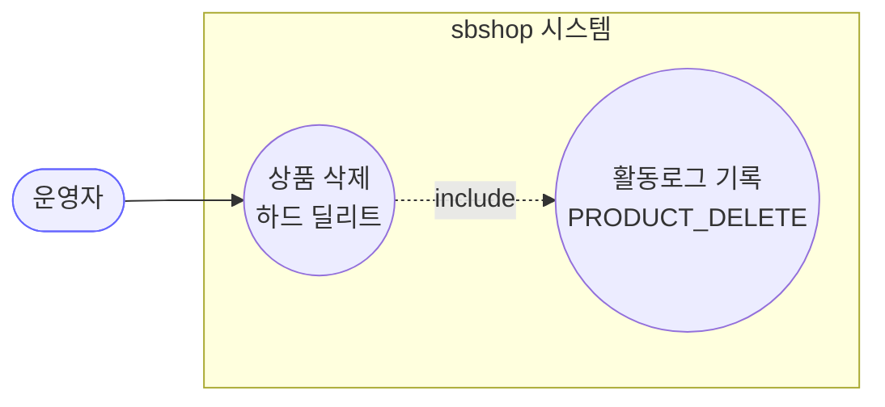
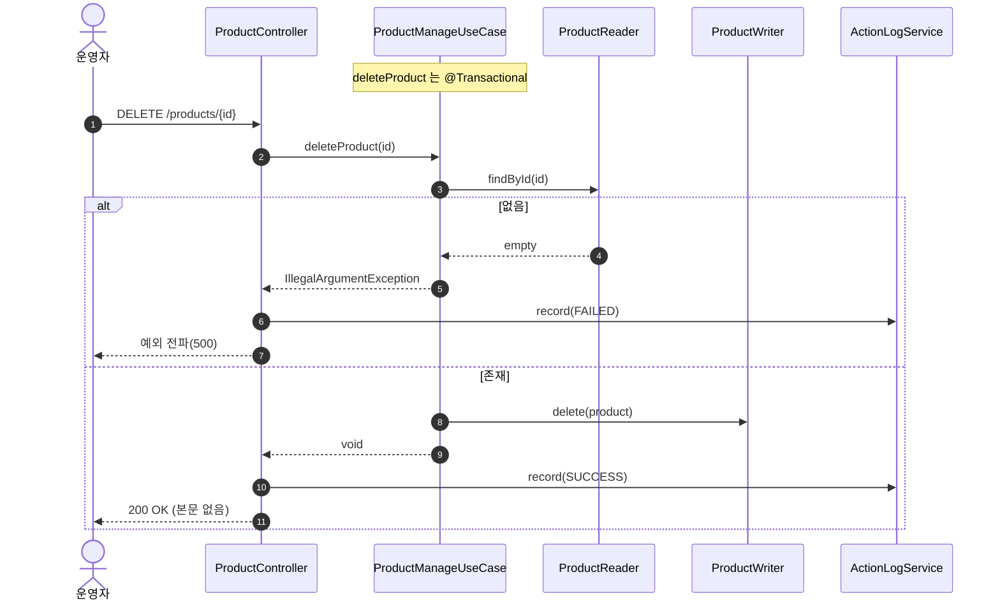
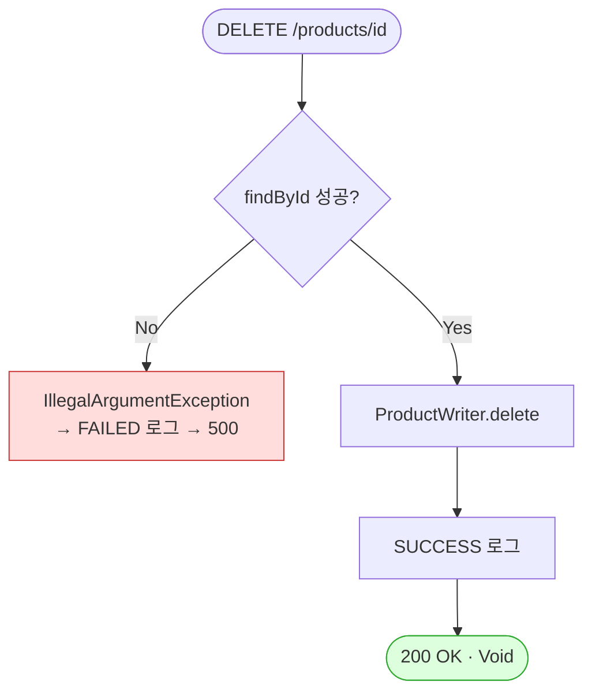

# DELETE /{id} — 상품 삭제

## 1. 개요

| 항목 | 내용 |
|------|------|
| **Method / URL** | `DELETE /api/v1/products/{id}` |
| **목적** | 상품 1건을 자사 DB 에서 삭제한다. |
| **핵심 상태전이** | 존재 → 삭제(하드 딜리트) |
| **부수효과** | **자사 DB 삭제만** — 마켓 연동 해제·마켓 삭제 없음(F-PROD-27) + 활동로그(P5, `PRODUCT_DELETE`) |
| **응답** | `200 OK` + 본문 없음(`ResponseEntity<Void>`) |

**경로 파라미터**

| 파라미터 | 타입 | 필수 | 비고 |
|----------|------|------|------|
| `id` | Long | ✅ | 상품 PK. 미존재 시 `IllegalArgumentException` |

## 2. 호출 체인

```
ProductController.deleteProduct()                  api/.../controller/ProductController.java:236-250
  └─ [try]
  │   └─ ProductManageUseCase.deleteProduct(id)     core/.../product/ProductManageUseCase.java:165-171  @Transactional
  │        ├─ ProductReader.findById() orElseThrow  ProductManageUseCase.java:167-168
  │        └─ ProductWriter.delete(product)         core/.../product/component/ProductWriter.java:11
  │   └─ actionLogService.record(PRODUCT_DELETE, null, SUCCESS, "상품 삭제 성공")  ProductController.java:242-243
  └─ [catch] actionLogService.record(..., FAILED, ...); throw  ProductController.java:245-248
```

## 3. 유스케이스 다이어그램



> **관찰:** 마켓 연동정보(`MarketRegistration`)·마켓 실제 상품에는 손대지 않는다. 순수 자사 삭제.

## 4. 시퀀스 다이어그램



## 5. 순서도 (플로우차트)



## 6. 상태 전이표

| 진입 조건 | 허용? | 결과 | 부수효과 | 비고 |
|-----------|:-----:|------|----------|------|
| `id` 존재 | ✅ | 하드 삭제 | 마켓 미반영 | 활동로그 SUCCESS |
| `id` 미존재 | ❌ | — | FAILED 로그 | `IllegalArgumentException` → 500 |
| 마켓 등록 有 상품 | ✅ | 하드 삭제 | **마켓 등록 잔존**(F-PROD-27) | 가드 없음 |

## 7. 🔎 발견사항

### F-PROD-27 · 🟠 GAP — 마켓 등록(`MarketRegistration`)이 있어도 상품이 무조건 하드 삭제됨(고아 연동 잔존)
> ⬜ **미해결(백로그)**.
- **근거:** `ProductManageUseCase.deleteProduct`(165-171)는 `MarketRegistrationRepository`를 참조하지 않고 `ProductWriter.delete`(`ProductWriter.java:11`)만 호출한다. 삭제 전 마켓 등록 존재 여부를 확인하거나 연동 정보를 함께 정리하는 로직이 없다.
- **영향:** 쿠팡/스토어 등에 게시 중인 상품을 삭제하면 자사 `sb_product`만 사라지고 `sb_market_registration` 행(및 마켓의 실제 상품)은 남는다. 이후 배치/재게시가 존재하지 않는 productId 를 참조하거나(고아 FK), 마켓엔 계속 노출되는데 자사엔 없어 정합성이 깨진다.
- **제안:** ① 마켓 등록이 있으면 삭제 차단(먼저 연동 해제 요구), 또는 ② 연동 정보 cascade 정리 + 필요시 마켓 판매중지 호출. 정책 확인 필요(DB FK/cascade 설정도 함께 점검).

### F-PROD-28 · 🟠 GAP — 삭제 확인/멱등성 없이 하드 딜리트(복구 불가·오삭제 위험)
> ⬜ **미해결(백로그)**.
- **근거:** `ProductWriterImpl.delete`(infrastructure/.../ProductWriterImpl.java:27-28)가 `productRepository.delete(product)`(JPA 물리 삭제)를 호출한다 — 소프트 삭제 플래그 없음. 컨트롤러에도 확인 파라미터 없음.
- **영향:** 오삭제 시 복구 경로가 없다. 재호출 시 두 번째는 미존재 id 로 500(멱등 아님).
- **제안:** 소프트 삭제(플래그) 또는 삭제 전 참조 무결성 검사 도입 검토. 미존재 삭제를 멱등(200/204)으로 볼지 정책 확정.

### F-PROD-29 · 🔵 NOTE — 미존재 id가 404 아닌 500 (get-product F-PROD-5·update F-PROD-26과 동형)
> ⬜ **미해결(백로그)**.
- **근거:** `ProductManageUseCase.java:168` `orElseThrow(IllegalArgumentException)`. FAILED 로그는 남으나 상태코드는 500.
- **제안:** 전역 예외 매핑에서 "없음→404" 처리 여부 점검(전 상품 API 공통).

## 8. 테스트 커버리지 메모

- **직접 테스트 없음:** `deleteProduct`를 대상으로 하는 테스트가 검색되지 않음.
- **비어있는 케이스:** ① 정상 삭제 + SUCCESS 로그, ② 미존재 id → FAILED 로그 후 재전파, ③ 마켓 등록 있는 상품 삭제 시 연동 잔존 여부(F-PROD-27), ④ 재삭제 멱등성(F-PROD-28).

---
*생성: 2026-07-14 · 근거 커밋: main@bd4c915*
