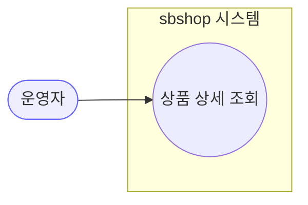
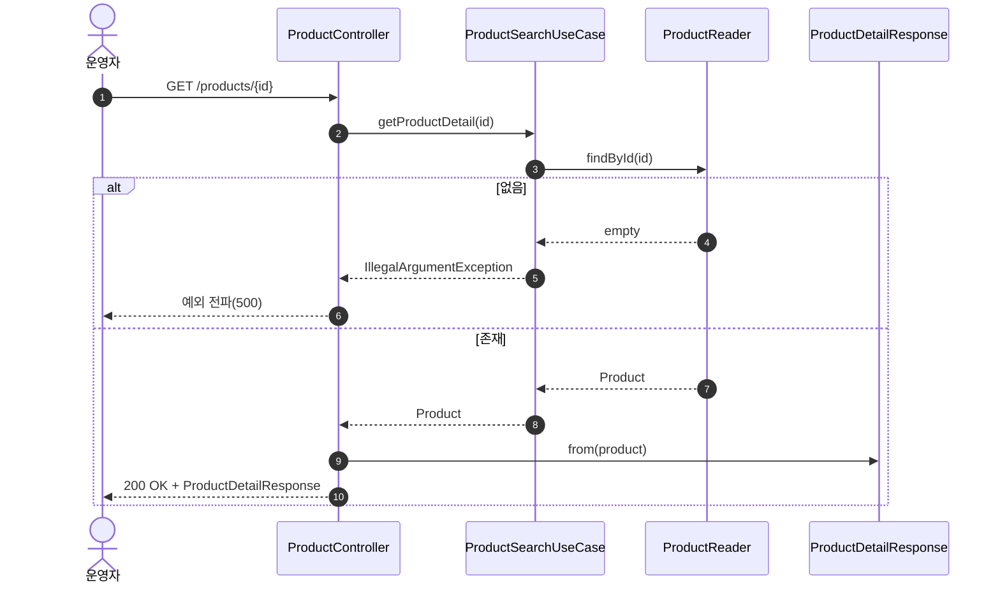
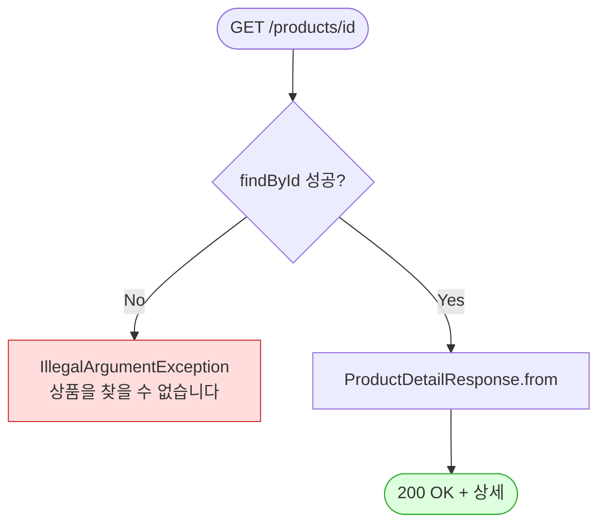

# GET /{id} — 상품 단건 상세 조회

## 1. 개요

| 항목 | 내용 |
|------|------|
| **Method / URL** | `GET /api/v1/products/{id}` |
| **목적** | 상품 1건의 전체 상세(가격·물류·규격·소싱·이미지·상세HTML 등)를 조회한다. |
| **핵심 상태전이** | 없음(순수 조회) |
| **부수효과** | **없음** — DB 읽기만. 활동로그 미기록. |
| **응답** | `200 OK` + `ProductDetailResponse` |

**경로 파라미터**

| 파라미터 | 타입 | 필수 | 비고 |
|----------|------|------|------|
| `id` | Long | ✅ | 상품 PK. 미존재 시 `IllegalArgumentException` |

## 2. 호출 체인

```
ProductController.getProduct()                     api/.../controller/ProductController.java:89-94
  └─ ProductSearchUseCase.getProductDetail(id)     core/.../product/ProductSearchUseCase.java:25-28
       └─ ProductReader.findById(id)               core/.../product/component/ProductReader.java:11
            └─ orElseThrow(IllegalArgumentException "상품을 찾을 수 없습니다")  ProductSearchUseCase.java:27
  └─ ProductDetailResponse.from(product)           api/.../dto/product/ProductDetailResponse.java:35-56
       (priceInfo/logisticsInfo/productSpec/sourcingInfo VO 를 그대로 노출)
```

## 3. 유스케이스 다이어그램



## 4. 시퀀스 다이어그램



## 5. 순서도 (플로우차트)



## 6. 상태 전이표

조회 API 로 상태 전이 없음.

| 진입 조건 | 결과 |
|-----------|------|
| `id` 존재 | 200 + 상세 |
| `id` 미존재 | `IllegalArgumentException` → 500 |

## 7. 🔎 발견사항

### F-PROD-5 · 🟠 GAP — 미존재 id가 404가 아닌 500으로 응답됨
- **근거:** `ProductSearchUseCase.java:27` `orElseThrow(() -> new IllegalArgumentException(...))`. 별도 예외 핸들러 없이 전파되면 스프링 기본 매핑으로 500이 된다(도메인 "없음"을 클라이언트 오류로 구분하지 않음).
- **영향:** 존재하지 않는 상품 조회가 서버 오류처럼 보인다. `updatePriceStock` 등 수정 계열은 `try/catch`로 감싸 FAILED 로그라도 남기지만, 이 조회는 로그도 없다.
- **제안:** "찾을 수 없음"에는 404 매핑(전역 `@ControllerAdvice`에서 `IllegalArgumentException`을 어떻게 처리하는지 확인 필요 — 프로젝트 공통 패턴 점검 대상).

### F-PROD-6 · 🟡 SMELL — 응답이 도메인 VO(`PriceInfo`/`LogisticsInfo`/`ProductSpec`/`SourcingInfo`)를 그대로 노출
- **근거:** `ProductDetailResponse.java:22-33`이 4개의 `@Embedded` VO 를 필드로 직접 담고 `from`(35-56)에서 `p.getPriceInfo()` 등을 그대로 전달한다.
- **영향:** 직렬화 형태가 도메인 VO 변경에 결합. 내부 표현(예: 원가 등 민감 필드)이 목록/상세 응답으로 유출될 수 있다. 주문 API 의 F-S5·F-H6(도메인 노출)과 같은 횡단 이슈.
- **제안:** 노출 필드를 평면화한 응답 DTO 또는 화면별 뷰 분리 검토(전 API 공통 개선 항목으로 승격 가능).

## 8. 테스트 커버리지 메모

- **직접 테스트 없음:** `getProduct` / `getProductDetail`(단건 상세 매핑)을 대상으로 하는 테스트가 검색되지 않음. 단, `crawlSourceImages`·`crawlAndUpload` 테스트가 내부적으로 `getProductDetail`을 스텁하여 간접 경유한다(`ProductControllerCrawlUploadTest`).
- **비어있는 케이스:** ① 미존재 id 예외(F-PROD-5), ② VO → DTO 매핑 완전성(F-PROD-6).

---
*생성: 2026-07-14 · 근거 커밋: main@bd4c915*
