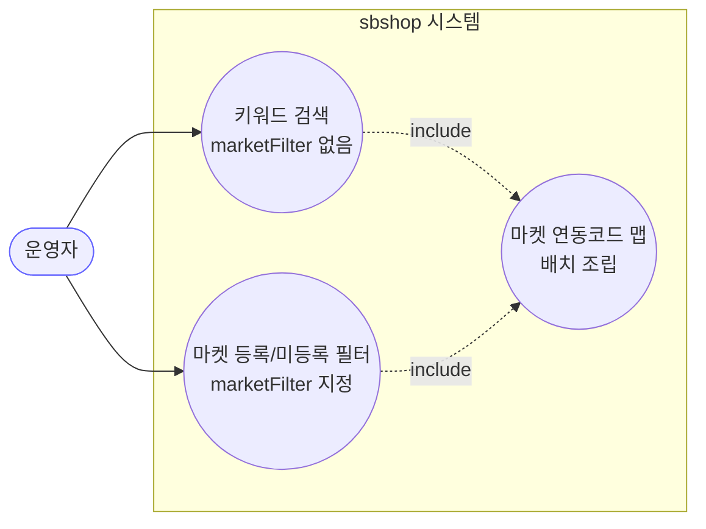
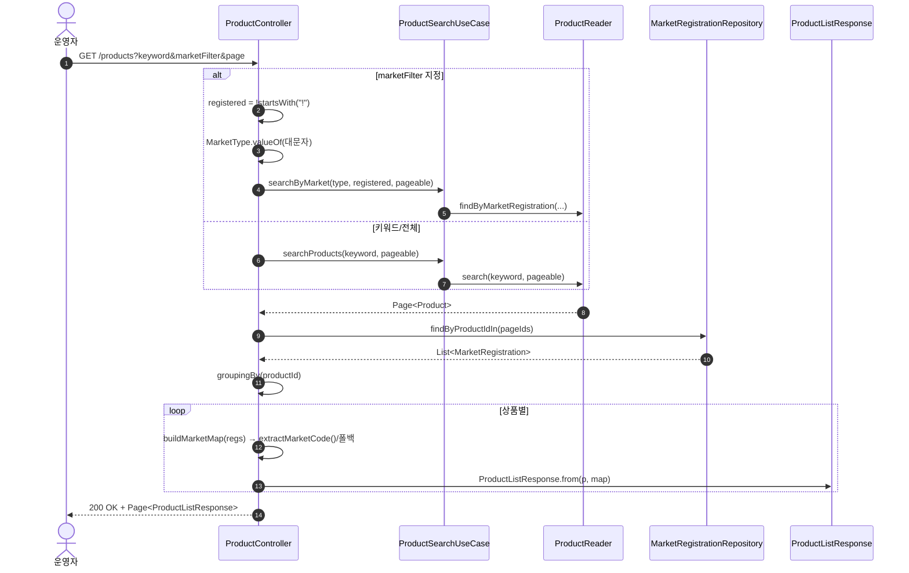
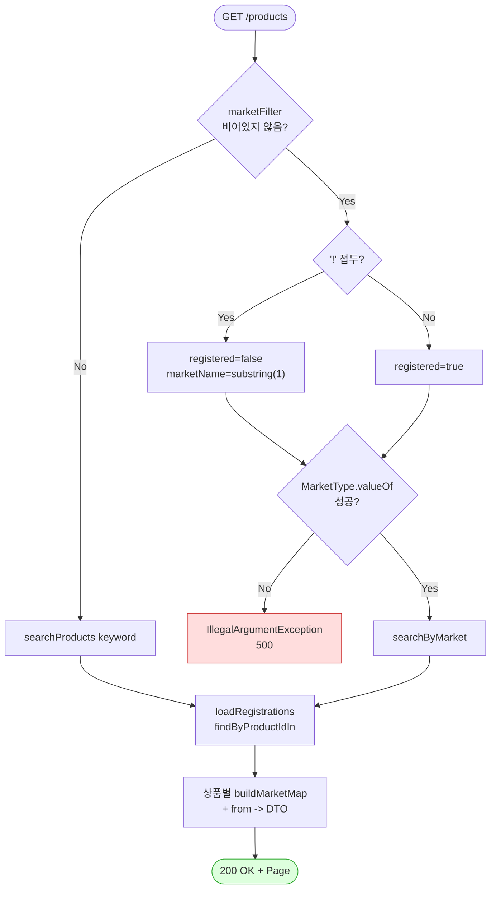

# GET / — 상품 목록 조회 (키워드/마켓 필터 + 페이지)

## 1. 개요

| 항목 | 내용 |
|------|------|
| **Method / URL** | `GET /api/v1/products` |
| **목적** | 상품을 키워드 또는 마켓 등록여부로 필터링하여 페이지 단위로 조회하고, 각 상품의 마켓별 연동 상품코드 맵을 함께 내려준다. |
| **핵심 상태전이** | 없음(순수 조회) |
| **부수효과** | **없음** — DB 읽기만. 활동로그 기록도 없음. |
| **응답** | `200 OK` + `Page<ProductListResponse>` |

**쿼리 파라미터**

| 파라미터 | 타입 | 필수 | 비고 |
|----------|------|------|------|
| `keyword` | String | No | `marketFilter` 미지정 시에만 사용(F-PROD-1) |
| `marketFilter` | String | No | 마켓명. 접두 `!` = 미등록 조회(`!COUPANG` → 쿠팡 미등록). `MarketType.valueOf(대문자)` |
| `pageable` | Pageable | No | `@PageableDefault(size = 50)` |

## 2. 호출 체인

```
ProductController.getProducts()                    api/.../controller/ProductController.java:66-87
  ├─ [marketFilter 있음] MarketType.valueOf(...)    ProductController.java:78  (대소문자 무관 대문자화)
  │    └─ ProductSearchUseCase.searchByMarket()     core/.../product/ProductSearchUseCase.java:21-23
  │         └─ ProductReader.findByMarketRegistration()  core/.../product/component/ProductReader.java:17
  ├─ [그 외] ProductSearchUseCase.searchProducts()  core/.../product/ProductSearchUseCase.java:17-19
  │    └─ ProductReader.search(keyword, pageable)   core/.../product/component/ProductReader.java:15
  ├─ loadRegistrations(products.getContent())       ProductController.java:256-263  (D-047 배치 조회)
  │    └─ MarketRegistrationRepository.findByProductIdIn()  → groupingBy(productId)
  └─ products.map(p -> ProductListResponse.from(p, buildMarketMap(...)))  ProductController.java:85-86
       ├─ buildMarketMap(registrations)             ProductController.java:307-322
       │    └─ MarketRegistration.extractMarketCode()  core/.../market/MarketRegistration.java:123 (코드 없으면 productId 폴백)
       └─ ProductListResponse.from(p, map)          api/.../dto/product/ProductListResponse.java:49-67
```

> **참고:** 이 API 는 컨트롤러가 `try/catch` + `actionLogService.record`로 감싸지 않은 유일한 조회 계열 상품 API 다(수정 계열 P1~P6 과 대조).

## 3. 유스케이스 다이어그램



> **관찰:** 외부 마켓과 상호작용하지 않는다(연동정보도 로컬 DB `sb_market_registration` 조회). marketFilter 는 조회 조건일 뿐 마켓 호출이 아니다.

## 4. 시퀀스 다이어그램



## 5. 순서도 (플로우차트)



## 6. 상태 전이표

조회 API 로 도메인 상태 전이 없음. 대신 **입력 → 조회 분기** 표로 대체한다.

| marketFilter | keyword | 실행 경로 | 비고 |
|--------------|---------|-----------|------|
| 없음/blank | 있음 | `searchProducts(keyword)` | 키워드 검색 |
| 없음/blank | 없음 | `searchProducts(null)` | 전체(Reader 구현에 위임) |
| `COUPANG` | (무시) | `searchByMarket(COUPANG, true)` | 쿠팡 등록분 |
| `!COUPANG` | (무시) | `searchByMarket(COUPANG, false)` | 쿠팡 미등록분 |
| 유효하지 않은 마켓명 | — | `IllegalArgumentException` → 500 | valueOf 실패 |

## 7. 🔎 발견사항

### F-PROD-1 · 🟡 SMELL — `marketFilter`와 `keyword`가 상호배타적이며 keyword가 조용히 무시됨
> ⬜ **미해결(백로그)**.
- **근거:** `ProductController.java:75-82` — `marketFilter`가 있으면 `searchByMarket`로 분기하고 `keyword`는 사용하지 않는다. 두 파라미터를 동시에 보내도 오류 없이 keyword만 버려진다.
- **영향:** "쿠팡 등록분 중 키워드 검색" 같은 조합 질의가 불가능하며, 클라이언트가 두 값을 함께 보내면 결과가 기대와 달라도 피드백이 없다.
- **제안:** 의도된 배타 관계라면 문서/응답에 명시. 조합 검색 요구가 있으면 Reader 쿼리에 marketType + keyword 동시 필터 지원.

### F-PROD-2 · 🟠 GAP — 유효하지 않은 `marketFilter` 값이 `MarketType.valueOf`에서 500으로 터짐
> 🔶 **부분/오탐** — 실제로는 400 응답(`valueOf`→`IllegalArgumentException`이 기존 핸들러로 400). 500 주장은 오탐.
- **근거:** `ProductController.java:78` `MarketType.valueOf(marketName.toUpperCase())` — 존재하지 않는 마켓명(오타 등)이면 `IllegalArgumentException`이 그대로 전파되어 500이 된다. 이 API 에는 컨트롤러 `try/catch`도 없다.
- **영향:** 잘못된 필터 입력이 400(Bad Request)이 아니라 500(Server Error)으로 보이며, 원인이 불명확하다.
- **제안:** valueOf 를 안전 파싱으로 감싸 알 수 없는 마켓명은 400 + 명확한 메시지로 응답.

### F-PROD-3 · 🔵 NOTE — 조회 계열이라 활동로그를 남기지 않음(수정 계열과 비대칭)
> ⬜ **미해결(백로그)**.
- **근거:** `getProducts`(66-87)·`getProduct`(89-94)에는 `actionLogService.record` 호출이 없다. P1~P6 수정/크롤 API 는 모두 기록.
- **영향:** 의도된 설계(조회는 로그 미기록)로 보이나, 마켓 미등록 필터 조회 등 감사 대상이 필요하면 공백.
- **제안:** 현행 유지가 자연스러우나 감사 요건 확인.

### F-PROD-4 · 🔵 NOTE — `buildMarketMap` 폴백 값(productId)과 실제 마켓코드가 응답에서 구분되지 않음
> ⬜ **미해결(백로그)**.
- **근거:** `ProductController.java:315-318` — `extractMarketCode()`가 null/empty면 `productId`를 문자열로 넣는다. `ProductListResponse.marketRegistrations`는 이 폴백값과 실제 마켓코드를 구별할 수단이 없다.
- **영향:** 프론트가 표시하는 "마켓 상품번호"가 실제로는 자사 productId 폴백일 수 있는데, 사용자는 진짜 마켓코드로 오인할 수 있다(`buildMarketMap`의 폴백은 '미확인' 의도이나 라벨이 없음).
- **제안:** 폴백 여부 플래그 또는 별도 표기('미확인') 를 응답에 반영 검토.

## 8. 테스트 커버리지 메모

- **존재:** `ProductControllerMarketMapTest`(api test) — `getProducts_assemblesMarketMapWithBatchQuery`: 배치 조회(`findByProductIdIn`)로 마켓 맵을 조립하고 키가 `MarketType.name()`과 일치함을 검증(D-047·D-052 계약).
- **비어있는 케이스:**
  - `marketFilter` 정상/`!`부정 분기(F-PROD-1) 및 유효하지 않은 마켓명(F-PROD-2) → 미검증.
  - keyword + marketFilter 동시 지정 시 keyword 무시(F-PROD-1) → 미검증.
  - 빈 페이지에서 `loadRegistrations`가 빈 맵 반환(`ProductController.java:258-260`) → 미검증.

---
*생성: 2026-07-14 · 근거 커밋: main@bd4c915*
