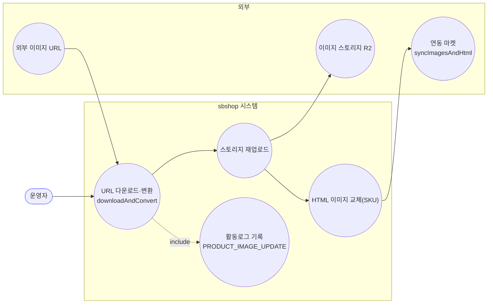
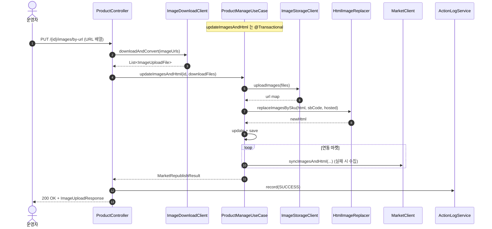
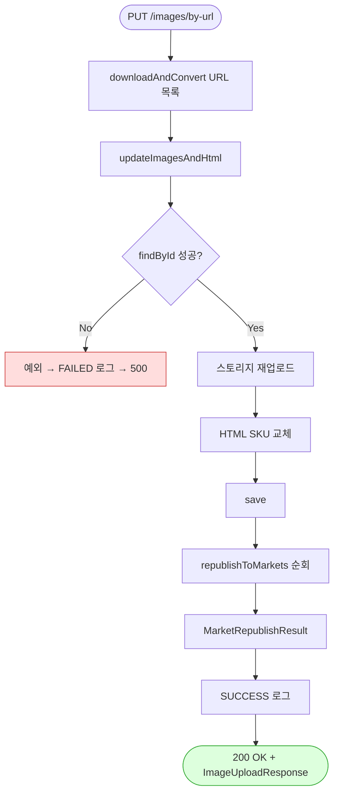

# PUT /{id}/images/by-url — 이미지 URL 다운로드·변환 후 등록 + 마켓 재게시

## 1. 개요

| 항목 | 내용 |
|------|------|
| **Method / URL** | `PUT /api/v1/products/{id}/images/by-url` |
| **목적** | 외부 이미지 URL 목록을 다운로드·변환하여 자사 스토리지에 재업로드하고, 상세HTML 교체 후 연동 마켓에 재게시한다. `PUT /{id}/images`(멀티파트)의 URL 입력 변형. |
| **핵심 상태전이** | 없음(상품 `hostedImages`·`detailHtml` 갱신) |
| **부수효과** | **이미지 다운로드/재업로드 + 마켓 재게시**(부분 실패 수집) + 활동로그(P2, `PRODUCT_IMAGE_UPDATE`) |
| **응답** | `200 OK` + `ImageUploadResponse` |

**요청 바디 (`@RequestBody List<String>`)**

| 필드 | 타입 | 필수 | 비고 |
|------|------|------|------|
| (본문 배열) | List\<String\> | ✅(사실상) | 이미지 URL 목록. 빈 배열 검증 없음(F-PROD-11 참조). `imageDownloadClient.downloadAndConvert`가 다운·변환 |

## 2. 호출 체인

```
ProductController.uploadImagesByUrl()              api/.../controller/ProductController.java:137-155
  ├─ ImageDownloadClient.downloadAndConvert(imageUrls)  core/.../product/client/ImageDownloadClient.java:12  → List<ImageUploadFile>
  └─ [try]
  │   └─ ProductManageUseCase.updateImagesAndHtml(id, downloadFiles)  core/.../product/ProductManageUseCase.java:67-92  @Transactional
  │        (이하 PUT /{id}/images 와 동일 경로:
  │         findById → ImageStorageClient.uploadImages → HtmlImageReplacer.replaceImagesBySku
  │         → Product.update(hostedImages,newHtml) → ProductWriter.save → republishToMarkets)
  │   └─ actionLogService.record(PRODUCT_IMAGE_UPDATE, null, SUCCESS, buildMarketResultMessage(...))  ProductController.java:147-148
  └─ [catch] actionLogService.record(..., FAILED, ...); throw  ProductController.java:150-153
       └─ ImageUploadResponse.from(result)          api/.../dto/product/ImageUploadResponse.java:29-37
```

> **핵심 차이(vs `PUT /{id}/images`):** 입력이 `MultipartFile`이 아니라 URL 리스트이고, 리사이즈(`prepareImageFiles`) 대신 **`downloadAndConvert`가 다운로드+변환**을 담당한다. 이후 `updateImagesAndHtml`부터는 **완전히 동일한 경로**를 공유한다.

## 3. 유스케이스 다이어그램



## 4. 시퀀스 다이어그램



## 5. 순서도 (플로우차트)



## 6. 상태 전이표

| 조건 | 자사 저장 | 마켓 전송 | 응답 |
|------|:---------:|-----------|------|
| 정상 | ✅ | 마켓별 synced/skipped/failed | 200 + storageUpdated=true |
| 빈 URL 배열 | ⚠️ no-op 가능 | 성공분 없음 | 200 (F-PROD-11) |
| 다운로드/업로드 실패 | ❌ 예외 전파 | — | FAILED 로그 → 500 |
| 마켓 일부 실패 | ✅ | failed 목록 표면화 | 200 |

## 7. 🔎 발견사항

### F-PROD-15 · 🟡 SMELL — `PUT /{id}/images`와 본문 로직 완전 중복(입력 어댑터만 상이)
- **근거:** `ProductController.java:137-155`(by-url)와 `117-135`(multipart)는 입력 준비(`downloadAndConvert` vs `prepareImageFiles`) 이후 `updateImagesAndHtml`→SUCCESS/FAILED 로그→`ImageUploadResponse.from`이 완전히 동일. `crawl-and-upload`(184-215)도 같은 꼬리를 공유한다.
- **영향:** 이미지 등록 3경로가 로그 배선·응답 매핑을 각자 복붙. F-PROD-11/12/13 같은 정책을 고칠 때 3곳을 동기화해야 한다.
- **제안:** "ImageUploadFile 리스트 → updateImagesAndHtml → 로그·응답" 공통 프라이빗 메서드로 추출하고, 각 엔드포인트는 입력 어댑터만 담당.

### F-PROD-16 · 🟠 GAP — 개별 URL 다운로드 실패 처리·부분 손실이 불투명
- **근거:** `ProductController.java:143` — `downloadAndConvert(imageUrls)` 결과만 받고, 어떤 URL 이 실패했는지 컨트롤러가 알지 못한다(`ImageDownloadClient` 계약상 실패 URL 을 별도로 전달하지 않음, `ImageDownloadClient.java:12`). 멀티파트의 F-PROD-12 와 동형.
- **영향:** 잘못된/접근 불가 URL 이 조용히 누락되어 일부 이미지만 등록될 수 있는데 200 을 반환.
- **제안:** 다운로드 실패 URL 개수를 응답/로그에 노출하거나 실패 시 예외 정책 확정.

### F-PROD-11 · 🟠 GAP — 빈 URL 배열 검증 부재 (참조)
- **근거·제안:** [update-images.md](update-images.md) F-PROD-11 참조. `by-url`은 빈 배열을 받아도 `downloadAndConvert`가 빈 리스트를 반환하고 no-op 성공(200)이 될 수 있다.

### F-PROD-13 · 🔵 NOTE — 빈 이미지로 삭제 불가 (참조)
- **근거·제안:** [update-images.md](update-images.md) F-PROD-13 참조. `Product.java:272-275` 빈 리스트 스킵.

## 8. 테스트 커버리지 메모

- **존재:**
  - `ProductControllerImageUploadTest`(api) — `uploadImagesByUrl_surfacesPartialMarketFailure`: 마켓 부분 실패가 응답 `failed` 목록에 실림.
  - `ProductControllerActionLogDetailTest`(api) — `uploadImagesByUrl_recordsMarketDetail`: 활동로그에 마켓별 상세.
  - (공유) `ProductManageUseCaseRepublishTest`·`ProductManageRepublishMarketCodeTest`(core) — `updateImagesAndHtml` 재게시 경로 검증.
- **비어있는 케이스:**
  - 빈 URL 배열(F-PROD-11) → 미검증.
  - 개별 URL 다운로드 실패/부분 손실(F-PROD-16) → 미검증.
  - multipart 경로와의 동작 동등성 → 명시 검증 없음.

---
*생성: 2026-07-14 · 근거 커밋: main@bd4c915*
