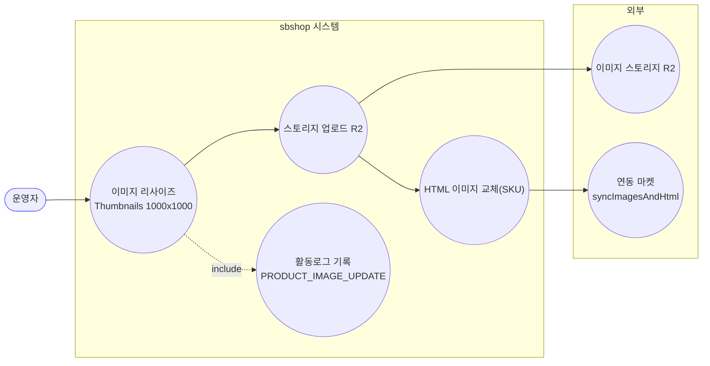
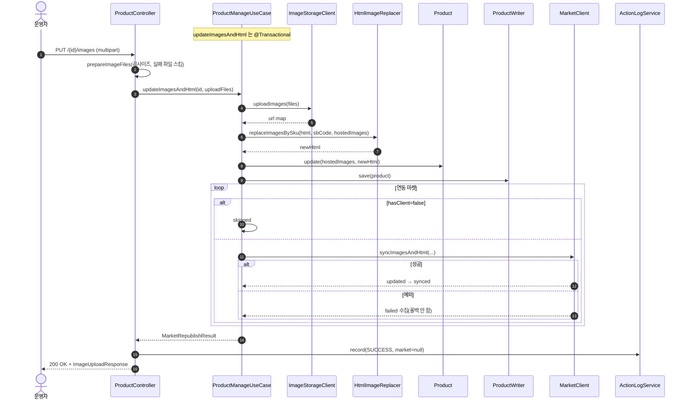
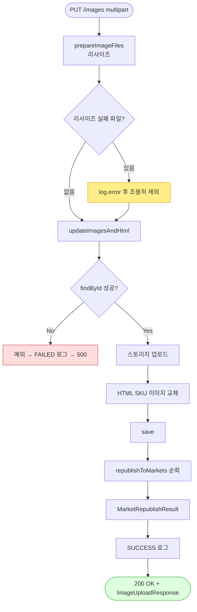

# PUT /{id}/images — 이미지 파일 업로드(멀티파트) + HTML 재조립 + 마켓 재게시

> **[C 반영 2026-07-15]** F-PROD-12·16 해결 — 이미지 개별 실패를 imagesFailed로 표면화 (커밋 `fee0baa`).

## 1. 개요

| 항목 | 내용 |
|------|------|
| **Method / URL** | `PUT /api/v1/products/{id}/images` (multipart/form-data) |
| **목적** | 운영자가 올린 이미지 파일들을 리사이즈·업로드하여 자사 스토리지(R2)에 저장하고, 상세HTML 의 이미지를 SKU 기준으로 교체한 뒤 연동 마켓에 재게시한다. |
| **핵심 상태전이** | 없음(상품 `hostedImages`·`detailHtml` 갱신) |
| **부수효과** | **이미지 스토리지 업로드 + 마켓 이미지/HTML 재게시**(부분 실패 수집) + 활동로그(P2) |
| **응답** | `200 OK` + `ImageUploadResponse`(storageUpdated=true + 마켓별 synced/skipped/failed) |

**요청 (`@RequestPart("images") List<MultipartFile>`)**

| 파트 | 타입 | 필수 | 비고 |
|------|------|------|------|
| `images` | List\<MultipartFile\> | ✅(사실상) | 빈 리스트/누락 검증 없음(F-PROD-11). 각 파일은 `Thumbnails`로 1000×1000 jpg 0.8품질 리사이즈 |

## 2. 호출 체인

```
ProductController.uploadImages()                   api/.../controller/ProductController.java:117-135
  ├─ prepareImageFiles(images)                     ProductController.java:324-347  (리사이즈, 실패 파일은 log만 하고 스킵)
  └─ [try]
  │   └─ ProductManageUseCase.updateImagesAndHtml(id, uploadFiles)  core/.../product/ProductManageUseCase.java:67-92  @Transactional
  │        ├─ ProductReader.findById() orElseThrow  ProductManageUseCase.java:69-70
  │        ├─ ImageStorageClient.uploadImages(imageFiles)  core/.../product/client/ImageStorageClient.java:8  → url map
  │        ├─ HtmlImageReplacer.replaceImagesBySku(detailHtml, sbCode, hostedImages)  ProductManageUseCase.java:75-76
  │        ├─ ProductUpdateCommand(hostedImages, newHtml 만 세팅)  ProductManageUseCase.java:78-84
  │        ├─ Product.update(command)               core/.../domain/product/Product.java:168-191
  │        │     ├─ detailHtml 병합(181-182) + updateImageInfo() (266-277, 빈리스트 스킵)
  │        ├─ ProductWriter.save(product)           ProductManageUseCase.java:86
  │        └─ republishToMarkets(id, hostedImages, newHtml)  ProductManageUseCase.java:102-142  (마켓별 client.syncImagesAndHtml, 부분실패 수집)
  │   └─ actionLogService.record(PRODUCT_IMAGE_UPDATE, null, SUCCESS, buildMarketResultMessage(...))  ProductController.java:127-128
  └─ [catch] actionLogService.record(..., FAILED, ...); throw  ProductController.java:130-133
       └─ ImageUploadResponse.from(result)          api/.../dto/product/ImageUploadResponse.java:29-37
```

## 3. 유스케이스 다이어그램



## 4. 시퀀스 다이어그램



## 5. 순서도 (플로우차트)



## 6. 상태 전이표

상품 상태 전이는 없음. **이미지 처리 결과** 표로 대체.

| 조건 | 자사 저장 | 마켓 전송 | 응답 |
|------|:---------:|-----------|------|
| 정상 | ✅ hostedImages/HTML 갱신 | 마켓별 synced/skipped/failed | 200 + storageUpdated=true |
| 일부 리사이즈 실패 | ✅ (성공분만) | 성공분 기준 | 200 (실패 파일은 조용히 누락 — F-PROD-12) |
| 스토리지 업로드 실패 | ❌ 예외 전파 | — | FAILED 로그 → 500 (본문 없음) |
| 마켓 일부 실패 | ✅ | failed 목록에 수집 | 200 + failed 표면화 |

## 7. 🔎 발견사항

> 이미지 등록 3경로(**images / by-url / crawl-and-upload**) 공통 이슈는 이 문서에 대표 등재하고 나머지 두 문서에서 참조한다.

### F-PROD-11 · 🟠 GAP — 빈/누락 이미지 입력 검증 부재 (3경로 공통)
- **근거:** `uploadImages`(117-135)는 `images`가 빈 리스트여도 그대로 진행한다. `prepareImageFiles`(324-347)가 빈 리스트를 받으면 빈 `uploadFiles` 반환 → `updateImagesAndHtml`가 빈 이미지로 실행되어 `hostedImages` 갱신 없이(빈리스트는 `updateImageInfo`에서 스킵, `Product.java:272-275`) HTML 만 재조립될 수 있다.
- **영향:** 이미지 0장 요청이 200 으로 성공 처리되며, `by-url`(137-155)도 빈 URL 리스트에 동일. 사용자는 이미지가 반영됐다고 오인할 수 있다.
- **제안:** 3경로 공통으로 빈/누락 입력 시 400 반환 또는 명시적 no-op 응답.

### F-PROD-12 · 🟠 GAP — 개별 이미지 리사이즈 실패가 조용히 삼켜짐(부분 손실)
- **근거:** `prepareImageFiles`(342-344) — 리사이즈 예외 시 `log.error`만 하고 해당 파일을 `uploadFiles`에 넣지 않는다. 호출부는 몇 장이 누락됐는지 알 수 없다.
- **영향:** 10장 중 3장이 손상/변환 실패해도 API 는 7장으로 200 을 반환하며, 사용자·마켓은 누락을 인지하지 못한다.
- **제안:** 실패 건수를 응답/로그 메시지에 포함하거나, 전량 성공을 요구하면 실패 시 예외.

### F-PROD-13 · 🔵 NOTE — `updateImageInfo`가 빈 리스트를 "미변경"으로 취급(이미지 삭제 불가)
- **근거:** `Product.java:272-275` — `sourceImages`/`hostedImages`가 `!= null && !isEmpty()`일 때만 덮어쓴다. 빈 리스트로는 기존 이미지를 지울 수 없다.
- **영향:** 모든 이미지를 제거하려는 편집 경로가 없다(부분 업데이트 의미로는 자연스러우나 "전체 교체/삭제" 요구 시 미충족). by-url 로 빈 배열을 보내도 no-op.
- **제안:** 삭제 요구 여부 확인. 있으면 sentinel 규칙 도입(소싱 F-S2 와 동형 이슈).

### F-PROD-14 · 🟡 SMELL — `updateImagesAndHtml`이 26-필드 커맨드를 2칸만 채워 생성
- **근거:** `ProductManageUseCase.java:78-84` — hostedImages/newHtml 위치만 세팅한 위치 기반 생성자. `updatePriceStock`(F-PROD-10)과 동형. 필드 순서 변경 시 오배치 위험.
- **제안:** 부분 업데이트 전용 빌더/팩토리.

## 8. 테스트 커버리지 메모

- **존재:**
  - `ProductControllerImageUploadTest`(api) — `uploadImages_surfacesRepublishResult`: 멀티파트 업로드 후 마켓 재게시 결과가 응답 본문에 실림.
  - `ProductManageUseCaseRepublishTest`(core) — 마켓별 `syncImagesAndHtml` 호출, 클라이언트 없는 마켓 스킵, 부분 실패 비차단(3 케이스).
  - `ProductManageRepublishMarketCodeTest`(core) — 마켓별 상품코드(originProductNo/prdNo/product_no) 전달 및 코드 부재 시 failed 수집.
- **비어있는 케이스:**
  - 빈/누락 이미지 입력(F-PROD-11) → 미검증.
  - 개별 리사이즈 실패 부분 손실(F-PROD-12) → 미검증.
  - 빈 리스트로 삭제 불가(F-PROD-13) → 미검증.

---
*생성: 2026-07-14 · 근거 커밋: main@bd4c915*
