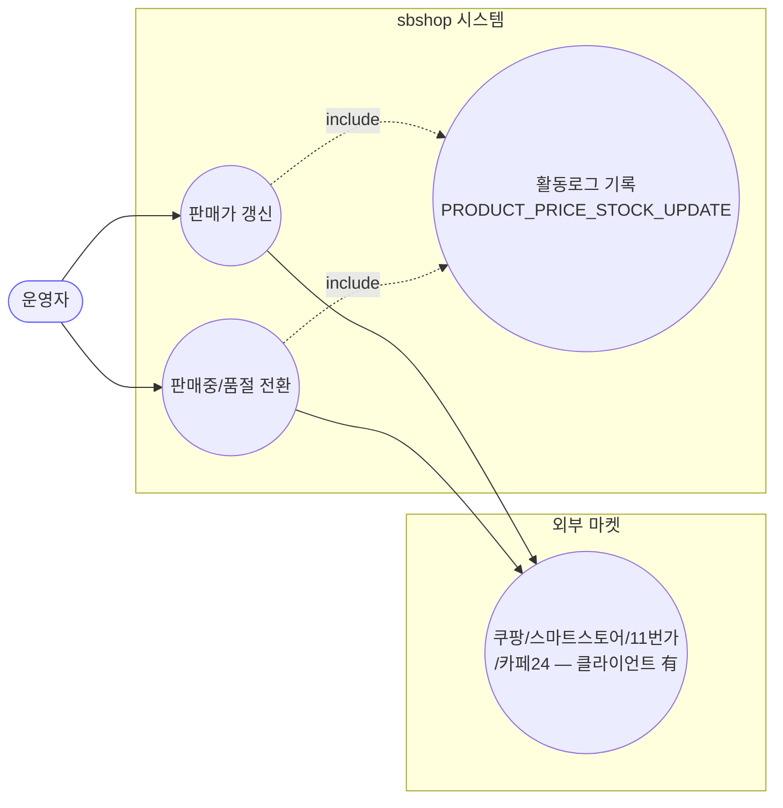
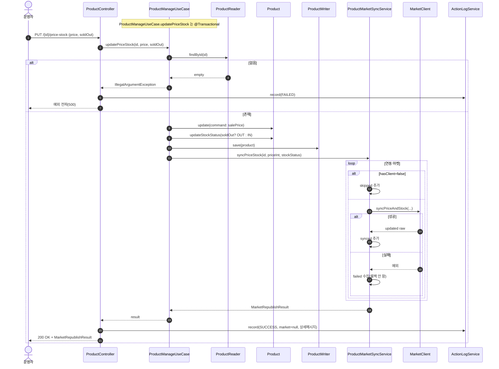
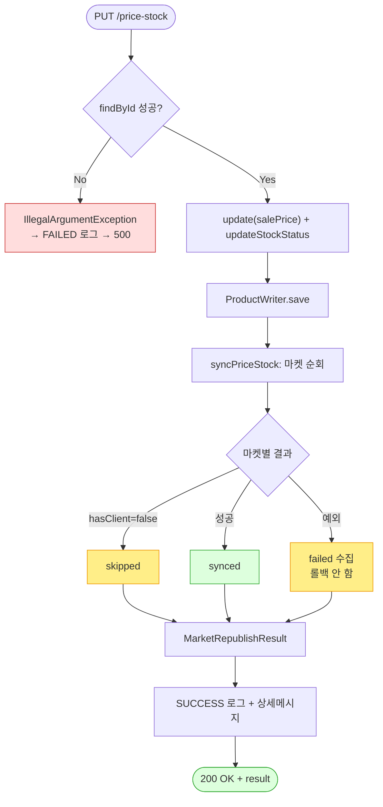

# PUT /{id}/price-stock — 가격·재고(판매/품절) 수정 + 마켓 반영

## 1. 개요

| 항목 | 내용 |
|------|------|
| **Method / URL** | `PUT /api/v1/products/{id}/price-stock` |
| **목적** | 자사 DB 의 판매가와 재고상태(판매중/품절)를 갱신하고, 연동된 각 마켓에 가격/재고를 반영한다. |
| **핵심 상태전이** | `stockStatus`: `IN_STOCK` ↔ `OUT_OF_STOCK` (`soldOut` 불리언 이분법) |
| **부수효과** | **마켓 가격/재고 전송**(부분 실패 수집, 롤백 안 함) + 활동로그 기록(P1) |
| **응답** | `200 OK` + `MarketRepublishResult`(synced/skipped/failed 마켓) |

**요청 바디 (`PriceStockUpdateRequest`)**

| 필드 | 타입 | 필수 | 비고 |
|------|------|------|------|
| `price` | BigDecimal | No | null 허용. **음수 검증 없음**(F-PROD-8). `product.update`에서 null-skip |
| `soldOut` | Boolean | No | `Boolean.TRUE.equals(request.soldOut())` — null/false 모두 판매중(IN_STOCK) 처리 |

## 2. 호출 체인

```
ProductController.updatePriceStock()               api/.../controller/ProductController.java:96-115
  └─ [try]
  │   └─ ProductManageUseCase.updatePriceStock(id, price, Boolean.TRUE.equals(soldOut))  core/.../product/ProductManageUseCase.java:43-65  @Transactional
  │        ├─ ProductReader.findById() orElseThrow  ProductManageUseCase.java:45-46
  │        ├─ ProductUpdateCommand(price만 세팅, 나머지 null)  ProductManageUseCase.java:49-55
  │        ├─ Product.update(command)               core/.../domain/product/Product.java:168-191
  │        │     └─ updatePriceInfo() → salePrice 만 병합  Product.java:193-212 (null-skip)
  │        ├─ Product.updateStockStatus(soldOut?OUT_OF_STOCK:IN_STOCK)  Product.java:281-283
  │        ├─ ProductWriter.save(product)           core/.../product/component/ProductWriter.java:7
  │        └─ ProductMarketSyncService.syncPriceStock(id, price.intValue(), stockStatus)  core/.../product/ProductMarketSyncService.java:34-38
  │             └─ syncInternal() → 마켓별 client.syncPriceAndStock(...)  ProductMarketSyncService.java:40-81 (부분실패 수집)
  │   └─ actionLogService.record(PRODUCT_PRICE_STOCK_UPDATE, null, SUCCESS, buildMarketResultMessage(...))  ProductController.java:107-108
  └─ [catch] actionLogService.record(..., FAILED, ...); throw  ProductController.java:110-114
```

**요청 → 도메인 매핑 요약**

| 요청 필드 | 도메인 반영 | 비고 |
|-----------|-------------|------|
| `price` | `PriceInfo.salePrice` (costPrice/marginRate 등은 미변경) | `ProductManageUseCase.java:52`에서 `salePrice` 위치에만 세팅 |
| `soldOut` | `Product.stockStatus` + 마켓 수량(품절 1 / 판매중 999) | `ProductMarketSyncService.java:35-36` |

## 3. 유스케이스 다이어그램



> **관찰:** GMARKET/AUCTION 은 `MarketClient` 구현체가 없어(`hasClient=false`) 마켓 전송에서 스킵된다(D-044).

## 4. 시퀀스 다이어그램



## 5. 순서도 (플로우차트)



## 6. 상태 전이표

| `soldOut` 입력 | 결과 stockStatus | 마켓 전송 수량 | 비고 |
|----------------|------------------|----------------|------|
| `true` | `OUT_OF_STOCK` | 1 | 품절 |
| `false` | `IN_STOCK` | 999 (`DEFAULT_IN_STOCK_QUANTITY`) | 판매중 |
| `null` | `IN_STOCK` | 999 | `Boolean.TRUE.equals` → false 로 판정(F-PROD-7) |

> 마켓 전송 결과: **synced**(성공) / **skipped**(클라이언트 없음: GMARKET/AUCTION) / **failed**(마켓 API 오류, 롤백 안 함).

## 7. 🔎 발견사항

### F-PROD-7 · 🟠 GAP — `soldOut` 미지정(null)이 조용히 "판매중"으로 처리됨
- **근거:** `ProductController.java:106` `Boolean.TRUE.equals(request.soldOut())` — `soldOut`이 null 이면 false → `IN_STOCK`. 즉 재고 필드를 생략한 "가격만 수정" 요청도 무조건 재고를 IN_STOCK 으로 덮어쓰고 마켓에 수량 999 를 전송한다.
- **근거2:** `ProductManageUseCase.java:56-58` — `updateStockStatus`는 항상 호출되므로, 현재 OUT_OF_STOCK 이던 상품이 가격만 바꾸려는 요청에서 의도치 않게 판매중으로 복귀할 수 있다.
- **영향:** 품절 상품의 가격만 조정하려다 판매 재개가 마켓까지 전파될 수 있다(정합성 위험).
- **제안:** `soldOut`이 null 이면 재고상태 미변경(부분 업데이트)으로 처리하거나, price-only / stock-only 를 분리. 최소한 계약에 "soldOut 생략=판매중"을 명시.

### F-PROD-8 · 🟠 GAP — `price` 음수·과대값 검증 부재
- **근거:** 요청(`PriceStockUpdateRequest`)·유스케이스·도메인(`Product.updatePriceInfo` `Product.java:201-210`) 어디에도 `price >= 0` 검증이 없다. null-skip 만 존재.
- **영향:** 음수 판매가가 자사 DB 에 저장되고 그대로 마켓에 전송 시도된다(마켓 API 가 거부하면 failed 로 남지만 자사 DB 는 이미 음수 저장).
- **제안:** `price != null && price >= 0` 검증 추가. 소싱 API 의 금액 검증 부재(F-S4)와 동일 계열 → 전 API 공통 정책화 검토.

### F-PROD-9 · 🔵 NOTE — `price.intValue()`로 소수점 절사 후 마켓 전송
- **근거:** `ProductManageUseCase.java:63` `price.intValue()` — 자사 DB 에는 BigDecimal `salePrice`로 저장되지만 마켓에는 int 로 절사되어 전송된다(`ProductMarketSyncService.syncPriceStock`가 Integer 파라미터).
- **영향:** 소수점 가격이 있는 마켓/통화라면 DB 값과 마켓 값이 불일치할 수 있다(국내 원화는 정수라 실무 영향 낮음).
- **제안:** 통화 정책상 정수 확정이면 문서화. 소수 가능성 있으면 반올림 규칙 명시.

### F-PROD-10 · 🟡 SMELL — `updatePriceStock`이 26-필드 `ProductUpdateCommand`를 price 한 칸만 채워 생성
- **근거:** `ProductManageUseCase.java:49-55` — 25개 null + `salePrice` 1개로 커맨드를 만든다. 위치 기반 생성자라 필드 순서가 바뀌면 조용히 다른 필드에 값이 들어갈 위험.
- **영향:** 가독성 저하·오배치 위험. `updateImagesAndHtml`(78-84)도 같은 방식.
- **제안:** 부분 업데이트 전용 빌더 또는 `withSalePrice` 팩토리 도입 검토.

## 8. 테스트 커버리지 메모

- **존재:**
  - `ProductManageUpdatePriceStockSoldOutTest`(core) — `soldOut=true→OUT_OF_STOCK`, `soldOut=false→IN_STOCK` 및 `syncPriceStock` 호출 인자 검증(2 케이스).
  - `ProductControllerActionLogDetailTest`(api) — 성공 시 마켓별 상세 로그 메시지(`updatePriceStock_recordsMarketDetail`), 실패사유 50자 절단(`updatePriceStock_truncatesFailureReasonTo50Chars`).
- **비어있는 케이스:**
  - `soldOut=null` 시 IN_STOCK 강제(F-PROD-7) → 미검증.
  - `price` 음수(F-PROD-8) → 미검증.
  - 미존재 id 시 FAILED 로그 후 재전파 경로 → 미검증.

---
*생성: 2026-07-14 · 근거 커밋: main@bd4c915*
