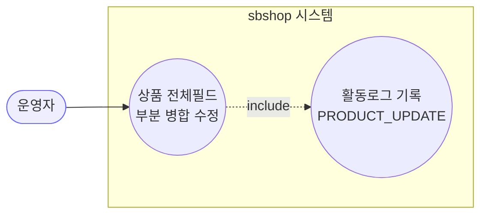
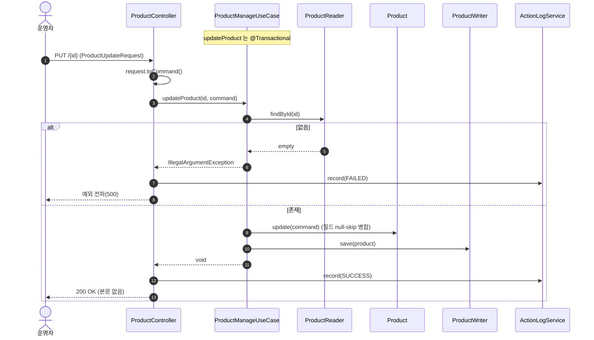
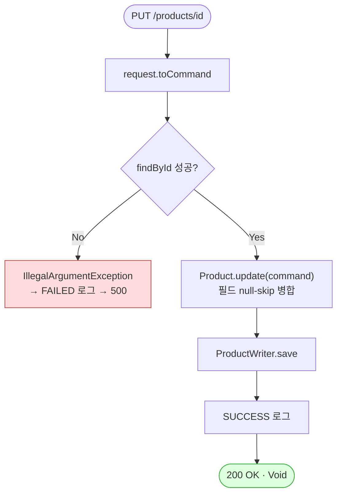

# PUT /{id} — 상품 전체 정보 수정

## 1. 개요

| 항목 | 내용 |
|------|------|
| **Method / URL** | `PUT /api/v1/products/{id}` |
| **목적** | 상품의 전체 필드(기본정보·가격·물류·규격·소싱·이미지·상세HTML·메모 등)를 자사 DB 에서 부분 병합 수정한다. |
| **핵심 상태전이** | 없음(필드 병합만) |
| **부수효과** | **없음(자사 DB 저장만)** — 마켓 전송 없음(price-stock/images 와 대조) + 활동로그(P4, `PRODUCT_UPDATE`) |
| **응답** | `200 OK` + 본문 없음(`ResponseEntity<Void>`) |

**요청 바디 (`ProductUpdateRequest`)** — 26개 필드, 전부 nullable, null-skip 병합

| 그룹 | 필드 | 도메인 반영 |
|------|------|-------------|
| 기본 | `brand,name,baseName,originalName,category` | Product 평면 필드(`Product.java:169-178`) |
| 가격 | `costPrice,exchangeRate,deliveryFee,marginRate,salePrice` | `PriceInfo`(193-212) |
| 물류 | `stock,weight,bundleQuantity` | `LogisticsInfo`(214-228) |
| 규격 | `barcode,capacity,measureUnit` | `ProductSpec`(230-244) |
| 소싱 | `vendor,sourceUrl,manufacturer,origin,hsCode` | `SourcingInfo`(246-264) |
| 이미지 | `sourceImages,hostedImages` | `ImageInfo`(266-277, **빈리스트 스킵**) |
| 기타 | `searchKeywords,detailHtml,memo` | 평면 필드(179-184) |

## 2. 호출 체인

```
ProductController.updateProduct()                  api/.../controller/ProductController.java:217-234
  ├─ ProductUpdateRequest.toCommand()              api/.../dto/product/ProductUpdateRequest.java:38-47  (26필드 그대로 위임)
  └─ [try]
  │   └─ ProductManageUseCase.updateProduct(id, command)  core/.../product/ProductManageUseCase.java:156-163  @Transactional
  │        ├─ ProductReader.findById() orElseThrow  ProductManageUseCase.java:158-159
  │        ├─ Product.update(command)               core/.../domain/product/Product.java:168-191
  │        │     └─ 8개 평면필드 null-skip + updatePriceInfo/updateLogisticsInfo/updateProductSpec/updateSourcingInfo/updateImageInfo
  │        └─ ProductWriter.save(product)           ProductManageUseCase.java:161
  │   └─ actionLogService.record(PRODUCT_UPDATE, null, SUCCESS, "상품정보 수정 성공")  ProductController.java:226-227
  └─ [catch] actionLogService.record(..., FAILED, ...); throw  ProductController.java:229-232
```

> **참고:** `updateProduct`는 마켓 재게시를 하지 않는다(가격/재고·이미지 수정과 달리 순수 자사 저장). 마켓 반영이 필요한 변경도 이 API 로는 전파되지 않음(F-PROD-25).

## 3. 유스케이스 다이어그램



> **관찰:** 외부 마켓과 상호작용 없음. 동일 컨트롤러의 price-stock/images 가 마켓에 전파하는 것과 대조.

## 4. 시퀀스 다이어그램



## 5. 순서도 (플로우차트)



## 6. 상태 전이표

상품 상태 전이 없음. **필드 병합 규칙** 표.

| 입력 필드 상태 | 동작 |
|----------------|------|
| null | 미변경(기존 유지) |
| 값 존재 | 덮어쓰기 |
| `sourceImages`/`hostedImages` 빈 리스트 | **미변경**(스킵, `Product.java:272-275`) — 삭제 불가 |
| 미존재 id | `IllegalArgumentException` → 500 |

## 7. 🔎 발견사항

### F-PROD-23 · 🟠 GAP — 금액·수량 필드 음수 검증 전무
> ✅ **해결됨** (커밋 `c41dee3`) — 체크리스트 기준.
- **근거:** `ProductUpdateRequest`·`ProductUpdateCommand`·`Product.update`(`Product.java:193-244`) 어디에도 `costPrice/salePrice/deliveryFee/marginRate/stock/weight/capacity ≥ 0` 검증이 없다. null-skip 만 존재.
- **영향:** 음수 판매가·음수 재고 등이 자사 DB 에 그대로 저장된다. price-stock(F-PROD-8)·소싱(F-S4)과 동일 계열의 광범위한 입력검증 공백.
- **제안:** 도메인 `update`에 값 범위 불변식 도입(전 상품 API 공통).

### F-PROD-24 · 🟡 SMELL — 성공/실패 활동로그가 마켓·변경필드 정보 없이 상수 문자열만 기록
> ⬜ **미해결(백로그)**.
- **근거:** `ProductController.java:226-227` — `"상품정보 수정 성공 (상품 " + id + ")"`. price-stock/images 는 `buildMarketResultMessage`로 마켓별 상세를 남기는데, 이 API 는 어떤 필드가 바뀌었는지 로그에 남지 않는다(market=null 도 이 API 는 마켓 무관이라 타당).
- **영향:** 감사/추적 시 "무엇을 바꿨는지" 활동로그로 알 수 없다.
- **제안:** 변경 필드 요약을 message 에 포함 검토(선택).

### F-PROD-25 · 🔵 NOTE — 전체수정이 마켓에 전파되지 않음(가격/이미지도 이 경로로는 로컬만 변경)
> ⬜ **미해결(백로그)**.
- **근거:** `ProductManageUseCase.updateProduct`(156-163)는 `republishToMarkets`/`syncPriceStock`를 호출하지 않는다. 반면 `salePrice`·`hostedImages`·`detailHtml`는 이 커맨드로도 변경 가능하다.
- **영향:** 운영자가 `PUT /{id}`로 판매가/이미지를 바꾸면 자사 DB 만 갱신되고 마켓은 옛 값을 유지 — 전용 엔드포인트(price-stock/images)를 써야만 마켓 반영. 두 경로의 결과 차이가 문서화되지 않으면 정합성 오해 소지.
- **제안:** "전체수정은 로컬 전용, 마켓 반영은 전용 API"임을 계약에 명시하거나, 마켓 반영 필요 필드 변경 시 재게시 트리거 검토.

### F-PROD-26 · 🔵 NOTE — 미존재 id가 404 아닌 500 (get-product F-PROD-5와 동형)
> ⬜ **미해결(백로그)**.
- **근거:** `ProductManageUseCase.java:159` `orElseThrow(IllegalArgumentException)`. FAILED 로그는 남으나 상태코드는 500.
- **제안:** 전역 예외 매핑에서 "없음→404" 처리 여부 점검(공통).

## 8. 테스트 커버리지 메모

- **직접 테스트 없음:** `updateProduct`(전체 필드 병합)를 대상으로 하는 단위/컨트롤러 테스트가 검색되지 않음.
- **비어있는 케이스:** ① null-skip 병합 정확성(어떤 필드가 바뀌고 유지되는지), ② 빈 이미지 리스트 스킵(F-PROD-13 동형), ③ 음수 값(F-PROD-23), ④ 미존재 id 시 FAILED 로그 후 재전파.

---
*생성: 2026-07-14 · 근거 커밋: main@bd4c915*
