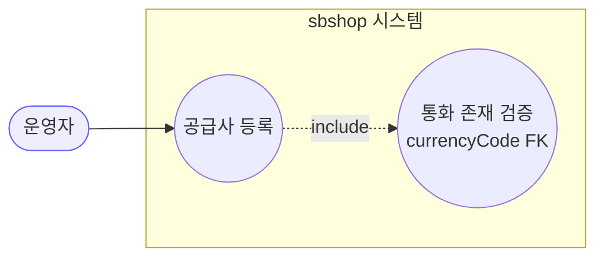
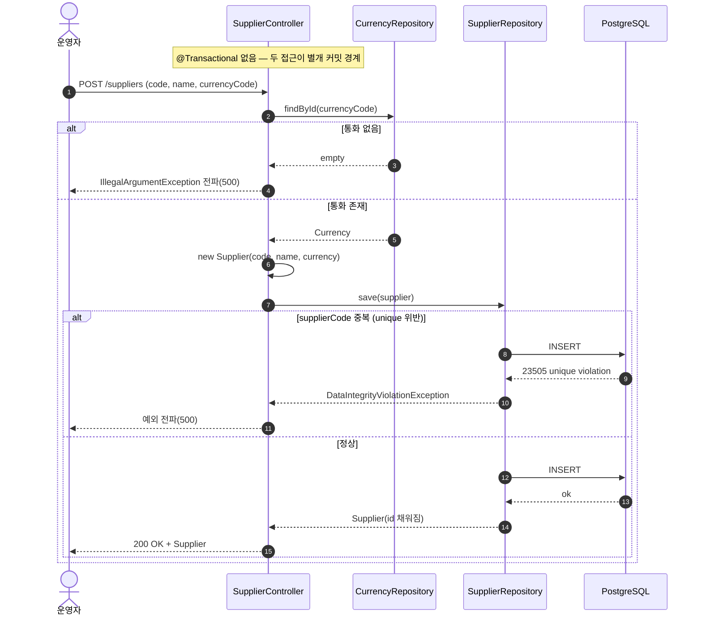
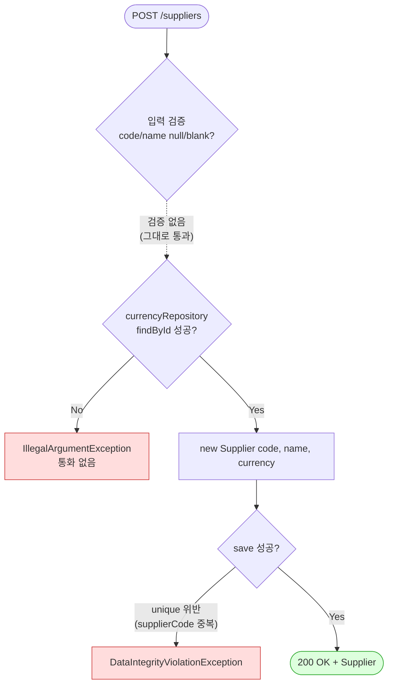

# POST /suppliers — 공급사(매입처) 등록

## 1. 개요

| 항목 | 내용 |
|------|------|
| **Method / URL** | `POST /api/v1/suppliers` |
| **목적** | 공급사 코드·명·통화를 받아 새 공급사를 등록한다. 통화코드는 기존 `Currency` 를 참조(FK)한다. |
| **핵심 상태전이** | 없음 (신규 INSERT) — 항상 `new Supplier(...)` 후 `save` |
| **부수효과** | **없음(로컬 저장만)** — 외부 마켓 전송 없음 |
| **응답** | `200 OK` + `Supplier` (도메인 엔티티 그대로) |

## 2. 호출 체인

```
SupplierController.createSupplier(request)        api/.../controller/SupplierController.java:34-41
  └─ currencyRepository.findById(request.currencyCode())   SupplierController.java:37
  │      └─ 없으면 IllegalArgumentException("통화 없음: ...")  SupplierController.java:38
  └─ new Supplier(code, name, currency)           core/.../supplier/Supplier.java:30-34
       └─ supplierRepository.save(supplier)        core/.../supplier/repository/SupplierRepository.java:7 (JpaRepository)
            └─ 반환: 저장된 Supplier (도메인 엔티티) SupplierController.java:40
```

> **관찰:** 서비스 계층 없음. 컨트롤러가 두 리포지토리(`currencyRepository`, `supplierRepository`)를 직접 오케스트레이션한다. `@Transactional` 어노테이션 **없음** — 두 DB 접근(findById + save)이 하나의 트랜잭션 경계로 묶이지 않는다(F-SUP-CS-4).

**요청 바디 (`SupplierRequest` record — `SupplierController.java:55`)**

| 필드 | 타입 | 필수 | 비고 |
|------|------|------|------|
| `supplierCode` | String | 사실상 필수 | null/blank 검증 **없음**. DB `nullable=false, unique=true, length=10` (`Supplier.java:20`) 이 최종 방어선 |
| `supplierName` | String | 사실상 필수 | null/blank 검증 **없음**. DB `nullable=false, length=100` |
| `currencyCode` | String | **필수** | `findById` 로 존재 검증됨 — 유일하게 명시 검증되는 필드 |

## 3. 유스케이스 다이어그램



> **관찰:** 통화(Currency)는 선행 마스터 데이터. 존재하지 않는 통화코드로는 등록 불가. 활동로그 미기록.

## 4. 시퀀스 다이어그램



## 5. 순서도 (플로우차트)



## 6. 상태 전이표

| 진입 조건 | 허용? | 결과 | 부수효과 | 비고 |
|-----------|:-----:|------|----------|------|
| `currencyCode` 미존재 | ❌ | — | 없음 | `IllegalArgumentException` → 500 |
| `supplierCode` 신규 | ✅ | INSERT | 없음 | 정상 등록 |
| `supplierCode` 기존과 중복 | ❌ | — | 없음 | DB `unique` 제약 위반 → 500 (검증 아닌 DB 예외, F-SUP-CS-2) |
| `supplierName` 중복 | ✅ | INSERT | 없음 | name 은 유니크 아님 — 동명 다수 허용 |
| `code`/`name` = null/blank | 조건부 | 대개 실패 | 없음 | 앱 검증 없음, DB `nullable=false` 만이 방어 (F-SUP-CS-1) |

## 7. 🔎 발견사항

### F-SUP-CS-1 · 🟠 GAP — `supplierCode`/`supplierName` 입력 검증 부재
> ✅ **해결됨** (커밋 `3970dd1`) — 체크리스트 기준.
- **근거:** `SupplierController.java:35-40` 어디에도 `request.supplierCode()`·`request.supplierName()` 에 대한 null/blank/길이 검증이 없다. `SupplierRequest` record(`:55`)에 `@NotBlank` 등 Bean Validation 도, `@Valid` 도 없다. 유일한 방어선은 DB 제약(`Supplier.java:20-24`: `nullable=false`, `length=10/100`).
- **영향:** blank(`""`) code/name 이 앱을 통과해 DB 까지 도달한다. length 초과·null 은 DB 예외(500)로만 거부되어 사용자에게 원인이 불명확한 500 이 반환된다.
- **제안:** `SupplierRequest` 에 `@NotBlank`·`@Size` 부여 + 컨트롤러 파라미터에 `@Valid`, 또는 서비스 진입 검증. `currencyCode` 만 명시 검증되는 현재 비대칭 해소.

### F-SUP-CS-2 · 🟠 GAP — 중복 `supplierCode` 를 사전 검증하지 않고 DB unique 예외에 의존
> ✅ **해결됨** (커밋 `3970dd1`) — 체크리스트 기준.
- **근거:** `supplierCode` 는 `unique=true`(`Supplier.java:20`)이고 `SupplierRepository.findBySupplierCode`(`:8`)라는 조회 메서드가 **이미 존재**하지만, `createSupplier` 는 이를 호출하지 않고 곧장 `save` 한다(`SupplierController.java:39-40`). 중복 시 `DataIntegrityViolationException`(23505) 이 그대로 전파된다.
- **영향:** 중복 등록 시도 시 사용자에게 "이미 존재하는 공급사 코드" 같은 도메인 메시지 대신 raw 500(제약 위반)이 반환된다. `currencyCode` 미존재는 친절한 `IllegalArgumentException("통화 없음: ...")` 로 처리하면서 `supplierCode` 중복은 방치 — 처리 대칭성 결여.
- **제안:** `findBySupplierCode(code).isPresent()` 사전 체크 후 명시적 예외(409/도메인 메시지). 기존 미사용 리포지토리 메서드 활용.

### F-SUP-CS-3 · 🟡 SMELL — 등록 로직이 서비스 없이 컨트롤러에 직접 존재
> ✅ **해결됨** (커밋 `d81fa42`) — 체크리스트 기준.
- **근거:** `SupplierController.java:37-40` 이 통화 조회 → 도메인 생성 → 저장의 유스케이스를 컨트롤러에서 직접 수행한다. order/product 계열이 `OrderService` 등 서비스 계층에 로직을 두는 것과 비대칭.
- **영향:** 트랜잭션 경계·검증·재사용성이 컨트롤러에 묶인다. 테스트 시 웹 계층 없이는 로직 검증이 어렵다.
- **제안:** `SupplierService.createSupplier(command)` 추출. 다른 도메인과 계층 규약 일치.

### F-SUP-CS-4 · 🔵 NOTE — 트랜잭션 경계 없음
> ⬜ **미해결(백로그)**.
- **근거:** `createSupplier` 에 `@Transactional` 없음(`SupplierController.java:34`). `findById` 와 `save` 가 각각 별도 트랜잭션(또는 OSIV 세션)에서 수행된다.
- **영향:** 단일 INSERT 이므로 원자성 문제는 현재 없으나, 검증/저장 로직 확장 시 경계 부재가 잠재 위험. `Supplier.currency` LAZY 참조 직렬화도 OSIV 의존.
- **제안:** 서비스 계층 도입(F-SUP-CS-3) 시 `@Transactional` 부여.

### F-SUP-CS-5 · 🔵 NOTE — 응답 도메인 엔티티 직접 노출 + 활동로그 미기록
> ⬜ **미해결(백로그)**.
- **근거:** `SupplierController.java:35`(반환 `Supplier`), ActionLog 미주입(`:26-27`). list-suppliers 의 F-SUP-1·F-SUP-3 과 동일.
- **영향:** `BaseEntity` 내부 필드·LAZY `currency` 유출 위험 + 공급사 생성 이력 부재.
- **제안:** 응답 DTO + (선택) ActionLog. 전 API 공통 개선 항목.

## 8. 테스트 커버리지 메모

- `createSupplier` 대상 테스트 **검색되지 않음**(백엔드 전체 0건).
- **비어있는 케이스:** ① 통화 미존재 → `IllegalArgumentException`, ② 정상 등록 → id 채워짐, ③ 중복 `supplierCode`(F-SUP-CS-2), ④ blank code/name(F-SUP-CS-1), ⑤ currencyCode-Supplier FK 매핑 정상성.
- 정책(F-SUP-CS-1·2) 확정 후 Red 테스트부터 추가 권장.

---
*생성: 2026-07-14 · 근거 커밋: main@bd4c915*
