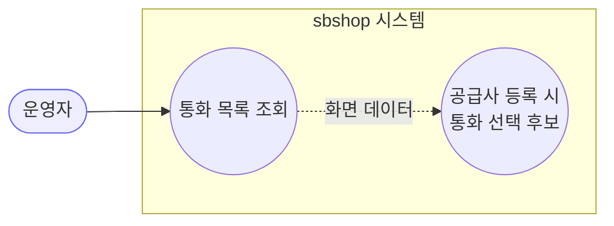
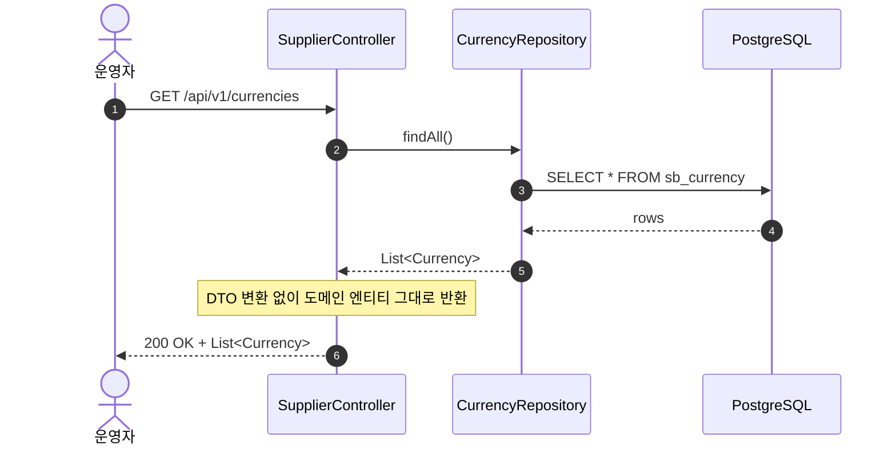
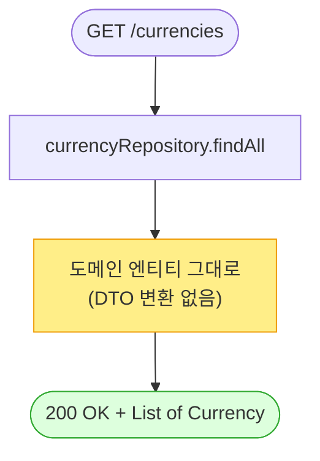

# GET /currencies — 통화 목록 조회

## 1. 개요

| 항목 | 내용 |
|------|------|
| **Method / URL** | `GET /api/v1/currencies` |
| **목적** | 등록된 모든 통화(코드·환율)를 목록으로 조회한다. 공급사 등록의 선행 마스터 데이터. |
| **핵심 상태전이** | 없음 (순수 읽기) |
| **부수효과** | **없음** — DB 읽기만 |
| **응답** | `200 OK` + `List<Currency>` (도메인 엔티티 그대로) |

## 2. 호출 체인

```
SupplierController.getCurrencies()               api/.../controller/SupplierController.java:43-46
  └─ currencyRepository.findAll()                core/.../supplier/repository/CurrencyRepository.java:6 (JpaRepository)
       └─ 반환: List<Currency>                    core/.../supplier/Currency.java:16 (도메인 엔티티)
```

> **관찰:** `getSuppliers` 와 동일 패턴 — 서비스 계층 없이 `currencyRepository.findAll()` 결과를 그대로 반환. `Currency` 는 `BaseEntity` 를 상속하지 **않으며**(`Currency.java:16`) `currencyCode` 자체가 `@Id`(`:18-20`)다. 따라서 `id`/`status`/감사 필드가 없다.

**요청 파라미터**

| 파라미터 | 타입 | 필수 | 비고 |
|----------|------|------|------|
| (없음) | — | — | 파라미터 없음 |

**응답 바디 (`Currency` 도메인 엔티티)**

| 필드 | 타입 | 비고 |
|------|------|------|
| `currencyCode` | String | `@Id`, `length=3` (`Currency.java:18-20`) — 자연키(PK) |
| `exchangeRate` | BigDecimal | `nullable=false` (`Currency.java:22-23`) |

## 3. 유스케이스 다이어그램



## 4. 시퀀스 다이어그램



## 5. 순서도 (플로우차트)



## 6. 상태 전이표

| 진입 상태 | 허용? | 결과 상태 | 부수효과 | 비고 |
|-----------|:-----:|-----------|----------|------|
| (해당 없음 — 읽기 전용) | ✅ | — | 없음 | 항상 200. 빈 목록이면 `[]` |

## 7. 🔎 발견사항

### F-SUP-LC-1 · 🟡 SMELL — 응답으로 도메인 엔티티(`Currency`) 직접 노출
> ✅ **해결됨** (커밋 `d556697`) — 체크리스트 기준.
- **근거:** `SupplierController.java:44` 반환 타입 `ResponseEntity<List<Currency>>`. JPA `@Entity` 를 그대로 직렬화한다.
- **영향:** `Currency` 는 연관·감사 필드가 없어 유출 위험은 낮으나(F-SUP-1 대비 경미), 직렬화 형태가 엔티티 변경에 결합되는 횡단 이슈는 동일.
- **제안:** 전 API 공통 DTO 정책에 포함. 단독 우선순위는 낮음.

### F-SUP-LC-2 · 🔵 NOTE — 정렬 부재
> ⬜ **미해결(백로그)**.
- **근거:** `findAll()`(`SupplierController.java:45`)은 정렬 순서를 보장하지 않는다.
- **영향:** 통화 수가 소수라 실무 영향 미미. 화면 표시 순서가 DB 물리 순서 의존.
- **제안:** `findAll(Sort.by("currencyCode"))` 안정 정렬 검토.

### F-SUP-LC-3 · 🔵 NOTE — 소프트삭제 개념 없음
> ⬜ **미해결(백로그)**.
- **근거:** `Currency` 는 `BaseEntity` 를 상속하지 않아(`Currency.java:16`) `status`(ACTIVE/ARCHIVED/DELETED) 개념이 없다. list-suppliers 의 F-SUP-2 와 달리 삭제 상태 필터 이슈는 발생하지 않는다.
- **영향:** 통화는 물리 삭제만 가능. 참조 중인 공급사가 있으면 FK 로 삭제 차단됨(별도 삭제 API 는 미제공).
- **제안:** 삭제 API 부재 자체가 의도인지 확인(현재 등록만 가능).

## 8. 테스트 커버리지 메모

- `getCurrencies`/`CurrencyRepository` 대상 테스트 **검색되지 않음**.
- **비어있는 케이스:** ① 빈 목록 → `[]`, ② 다중 통화 반환 형태.
- 마스터 데이터 조회라 우선순위 낮음.

---
*생성: 2026-07-14 · 근거 커밋: main@bd4c915*
