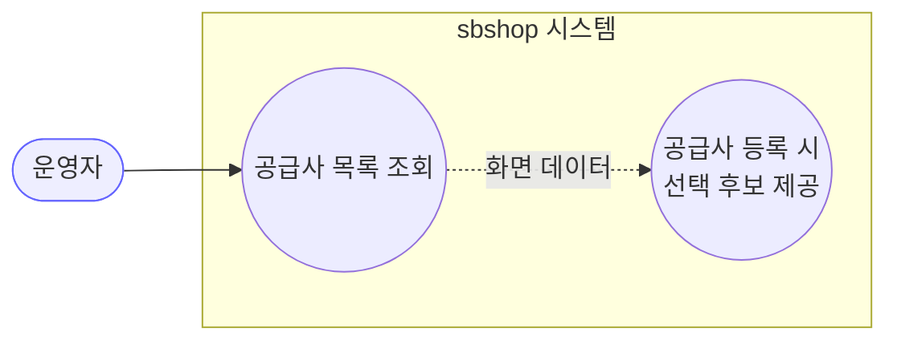
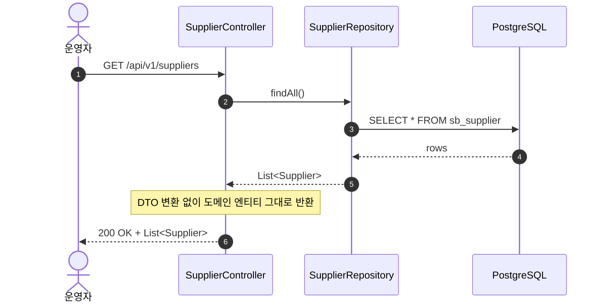
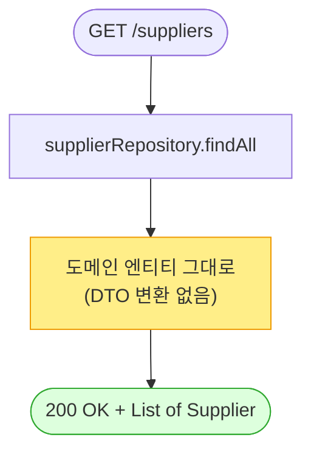

# GET /suppliers — 공급사(매입처) 목록 조회

> **[E 반영 2026-07-15]** F-SUP-1 — SupplierResponse DTO, LAZY 유출 차단 (커밋 `d556697`).

## 1. 개요

| 항목 | 내용 |
|------|------|
| **Method / URL** | `GET /api/v1/suppliers` |
| **목적** | 등록된 모든 공급사(매입처)를 목록으로 조회한다. |
| **핵심 상태전이** | 없음 (순수 읽기) |
| **부수효과** | **없음** — DB 읽기만, 외부 마켓 전송 없음 |
| **응답** | `200 OK` + `List<Supplier>` (도메인 엔티티 그대로) |

## 2. 호출 체인

```
SupplierController.getSuppliers()                api/.../controller/SupplierController.java:29-32
  └─ supplierRepository.findAll()                core/.../supplier/repository/SupplierRepository.java:7  (JpaRepository 상속)
       └─ 반환: List<Supplier>                    core/.../supplier/Supplier.java:18  (도메인 엔티티)
```

> **관찰:** 서비스 계층이 없다. 컨트롤러가 `SupplierRepository` 를 직접 주입받아(`SupplierController.java:26`) `findAll()` 결과를 그대로 `ResponseEntity.ok()` 로 감싼다. DTO 변환·정렬·페이징·필터 없음.

**요청 파라미터**

| 파라미터 | 타입 | 필수 | 비고 |
|----------|------|------|------|
| (없음) | — | — | 쿼리스트링·경로변수·바디 모두 없음 |

**응답 바디 (`Supplier` 도메인 엔티티)**

| 필드 | 타입 | 비고 |
|------|------|------|
| `id` | Long | `BaseEntity` 상속 (`BaseEntity.java:19`) |
| `status` | RecordStatus | `BaseEntity` — ACTIVE/ARCHIVED/DELETED. **필터 없이 전부 노출** (F-SUP-2) |
| `createdAt` / `updatedAt` | LocalDateTime | `BaseEntity` 감사 필드 |
| `supplierCode` | String | 유니크 코드 (`Supplier.java:20-21`) |
| `supplierName` | String | 표시명 (`Supplier.java:23-24`) |
| `currency` | Currency | **LAZY `@ManyToOne`** (`Supplier.java:26-28`) — 직렬화 시 지연로딩 유출 위험 (F-SUP-1) |

## 3. 유스케이스 다이어그램



> **관찰:** 외부 마켓과 무관한 순수 내부 마스터 데이터 조회. 활동로그(ActionLog) 기록도 없다.

## 4. 시퀀스 다이어그램



## 5. 순서도 (플로우차트)



## 6. 상태 전이표

| 진입 상태 | 허용? | 결과 상태 | 부수효과 | 비고 |
|-----------|:-----:|-----------|----------|------|
| (해당 없음 — 읽기 전용) | ✅ | — | 없음 | 어떤 조건에서도 200. 빈 목록이면 `[]` |

## 7. 🔎 발견사항

### F-SUP-1 · 🟡 SMELL — 응답으로 도메인 엔티티(`Supplier`) 직접 노출 + LAZY 연관 유출 위험
- **근거:** `SupplierController.java:30` 반환 타입이 `ResponseEntity<List<Supplier>>`. `Supplier.currency` 는 `@ManyToOne(fetch = FetchType.LAZY)` (`Supplier.java:26`). 트랜잭션 없는 컨트롤러 반환 시점에 Jackson 이 `currency` 를 직렬화하려 하면 LazyInitialization 또는 예상치 못한 추가 쿼리가 발생할 수 있다.
- **영향:** 직렬화 형태가 도메인 변경에 결합. `BaseEntity` 의 `status`·감사 필드까지 클라이언트에 노출된다. order 계열의 F-S5/F-H6 과 동일한 횡단 이슈.
- **제안:** `SupplierDto(id, supplierCode, supplierName, currencyCode)` 응답 DTO 도입. 전 API 공통 개선 항목으로 승격 검토.

### F-SUP-2 · 🟠 GAP — `RecordStatus` 필터 부재로 ARCHIVED/DELETED 공급사까지 조회됨
- **근거:** `findAll()` (`SupplierRepository.java:7`) 은 소프트삭제 상태를 구분하지 않는다. `BaseEntity` 는 `archive()`·`delete()` 로 `status` 를 변경하는 소프트삭제 모델(`BaseEntity.java:34-40`)을 가지지만, 조회는 `status` 를 무시하고 전부 반환한다.
- **영향:** 삭제/보관 처리한 공급사가 목록·드롭다운에 계속 나타난다. 소프트삭제 규약이 조회 경로에서 지켜지지 않음.
- **제안:** 소프트삭제를 실제 운용한다면 `findAllByStatus(ACTIVE)` 로 좁히거나 `@Where`/`@SQLRestriction` 도입. 운용하지 않는다면 `archive/delete` 미사용임을 문서화.

### F-SUP-3 · 🔵 NOTE — 활동로그(ActionLog) 미기록
- **근거:** 다른 컨트롤러(`OrderController`, `ProductController` 등 9개)는 `ActionLogService` 를 주입해 이벤트를 남기지만 `SupplierController` 는 주입조차 없다(`SupplierController.java:26-27`).
- **영향:** 조회는 로그 불필요가 일반적이라 낮은 우선순위. 다만 등록 계열(create-supplier/upsert-currency)에서도 동일하게 로그가 없어(F-SUP-CS-*, F-SUP-UC-*) 마스터 데이터 변경 이력이 전무하다.
- **제안:** 조회는 유지, **등록/수정** 계열에 한해 ActionLog 도입 검토.

### F-SUP-4 · 🔵 NOTE — 정렬·페이징 부재
- **근거:** `findAll()` 은 정렬 순서를 보장하지 않고 전량 반환한다(`SupplierController.java:31`).
- **영향:** 공급사 수가 적은 마스터 데이터라 실무 영향은 낮으나, 화면 표시 순서가 DB 물리 순서에 의존한다.
- **제안:** `findAll(Sort.by("supplierName"))` 등 안정 정렬만이라도 부여 검토.

## 8. 테스트 커버리지 메모

- `SupplierController`·`SupplierRepository` 를 대상으로 하는 테스트가 **검색되지 않음**(백엔드 전체에서 `SupplierController`/`createSupplier` 참조 테스트 0건).
- **비어있는 케이스:** ① 빈 목록 → `[]` 반환, ② ARCHIVED/DELETED 포함 여부(F-SUP-2 정책 확정 후), ③ LAZY `currency` 직렬화 정상 여부(F-SUP-1).
- 마스터 데이터 조회라 우선순위는 등록 계열보다 낮음.

---
*생성: 2026-07-14 · 근거 커밋: main@bd4c915*
