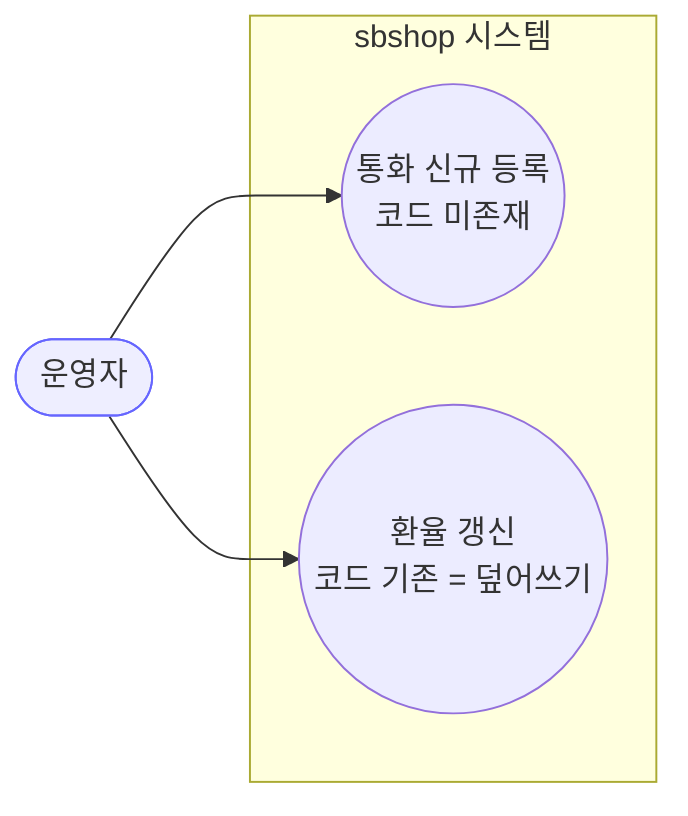
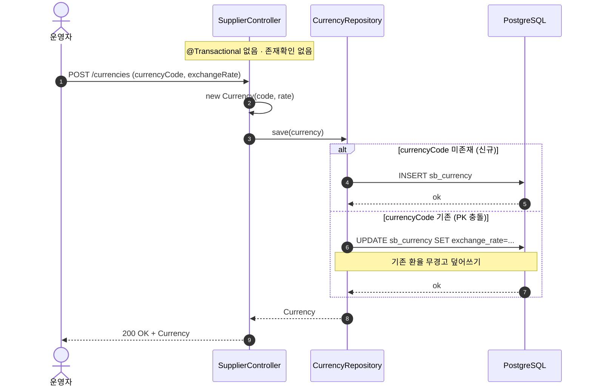
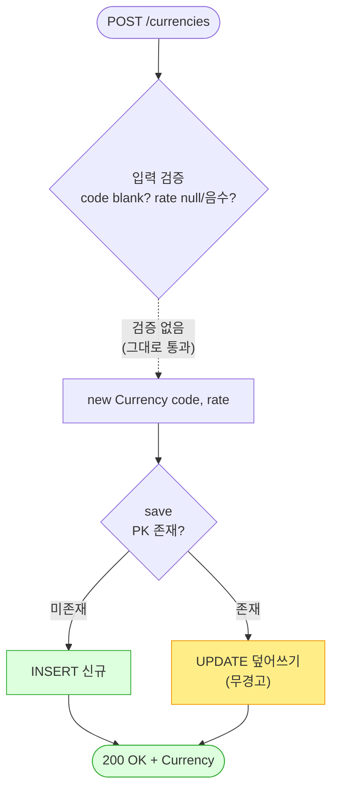

# POST /currencies — 통화 등록/갱신(사실상 upsert)

> **[반영 2026-07-15]** F-SUP-UC-1·2·3(🔴) 해결 — 통화 중복 생성 거부(기존 환율 불변)+환율/코드 검증 (커밋 `e69496e`).

## 1. 개요

| 항목 | 내용 |
|------|------|
| **Method / URL** | `POST /api/v1/currencies` |
| **목적** | 통화코드·환율을 받아 저장한다. 표면상 "생성"이지만 `currencyCode` 가 `@Id`(자연키)라 **기존 코드로 POST 하면 환율이 조용히 덮어써진다(upsert)**. |
| **핵심 상태전이** | 없음 — `new Currency(code, rate)` 후 `save`. JPA `save` 는 PK 존재 시 merge(UPDATE), 미존재 시 INSERT |
| **부수효과** | **없음(로컬 저장만)** — 외부 마켓 전송 없음. 단, **기존 환율 무경고 덮어쓰기** 가능 (F-SUP-UC-1) |
| **응답** | `200 OK` + `Currency` (도메인 엔티티 그대로) |

## 2. 호출 체인

```
SupplierController.createCurrency(request)        api/.../controller/SupplierController.java:48-53
  └─ new Currency(request.currencyCode(), request.exchangeRate())  core/.../supplier/Currency.java:25-28
       └─ currencyRepository.save(currency)        core/.../supplier/repository/CurrencyRepository.java:6 (JpaRepository)
            └─ (PK 존재 → UPDATE / 미존재 → INSERT)  ※ SimpleJpaRepository.save: persist vs merge 분기
            └─ 반환: 저장된 Currency               SupplierController.java:52
```

> **관찰:** 메서드명은 `createCurrency` 지만 실제 의미는 **upsert(덮어쓰기)** 다. `currencyCode` 가 `@Id`(`Currency.java:18`)이므로 `save` 는 동일 PK 존재 시 UPDATE 로 동작한다. 사전 존재 여부 확인·병합 로직 없이 요청값으로 새 인스턴스를 만들어 통째로 저장한다. `@Transactional` 없음.

**요청 바디 (`CurrencyRequest` record — `SupplierController.java:58`)**

| 필드 | 타입 | 필수 | 비고 |
|------|------|------|------|
| `currencyCode` | String | **필수(사실상)** | null/blank/길이 검증 **없음**. DB `@Id, length=3`(`Currency.java:19`)만 방어. PK 이므로 재사용 시 덮어쓰기 |
| `exchangeRate` | BigDecimal | **필수(사실상)** | **값 검증 전무** — null·0·음수 모두 통과. DB `nullable=false`(`:22`)만 null 방어 (F-SUP-UC-2) |

## 3. 유스케이스 다이어그램



> **관찰:** 단일 엔드포인트가 "생성"과 "갱신" 두 유스케이스를 구분 없이 처리한다. 사용자는 갱신인지 신규인지 응답만으로 구별할 수 없다.

## 4. 시퀀스 다이어그램



## 5. 순서도 (플로우차트)



## 6. 상태 전이표

| 진입 조건 | 허용? | 결과 | 부수효과 | 비고 |
|-----------|:-----:|------|----------|------|
| `currencyCode` 신규 | ✅ | INSERT | 없음 | 정상 등록 |
| `currencyCode` 기존 | ✅ | **UPDATE(덮어쓰기)** | **기존 환율 소실** | "생성" 의도로 호출해도 조용히 갱신됨 (F-SUP-UC-1) |
| `exchangeRate` = null | ❌ | — | 없음 | DB `nullable=false` 위반 → 500 (앱 검증 아님) |
| `exchangeRate` = 0 또는 음수 | ✅ | INSERT/UPDATE | 없음 | **검증 없음** — 비정상 환율 저장 (F-SUP-UC-2) |
| `currencyCode` = blank/길이초과 | 조건부 | 대개 실패 | 없음 | 앱 검증 없음, DB `length=3` 만 방어 |

## 7. 🔎 발견사항

### F-SUP-UC-1 · 🔴 BUG(후보) — "생성" API 가 기존 통화 환율을 무경고로 덮어씀 (upsert vs create 혼동)
- **근거:** `SupplierController.java:51-52` 는 존재 확인 없이 `new Currency(code, rate)` 를 만들어 `save` 한다. `currencyCode` 는 `@Id`(`Currency.java:18`)라 JPA `save`(SimpleJpaRepository)는 동일 PK 존재 시 `merge`→UPDATE 로 동작한다. 메서드·URL 은 "create(POST)" 시맨틱이지만 실제는 upsert.
- **영향:** 운영자가 이미 존재하는 통화(예: `USD`)를 신규 등록으로 착각해 다른 환율로 POST 하면 **기존 환율이 조용히 교체**된다. 이 통화를 참조하는 모든 공급사(`Supplier.currency`, FK)의 환율 기준이 즉시 바뀌어 **정산·매입원가 계산에 광범위 파급**된다. create-supplier(F-SUP-CS-2)가 `supplierCode` 중복을 DB 예외로라도 막는 것과 달리, 여기선 중복이 예외 없이 데이터 손실로 이어진다.
- **제안:** 의도가 upsert 라면 메서드/문서를 `upsertCurrency` 로 명확화하고 갱신임을 응답/로그로 노출. 의도가 create 라면 `existsById(code)` 사전 확인 후 중복 시 명시적 예외(409). 환율 변경은 이력이 필요하면 별도 갱신 API + 변경 로그로 분리.
- **연관:** 정산/매입원가 기준 데이터 → 결함 원장 등재 권장.

### F-SUP-UC-2 · 🟠 GAP — `exchangeRate` 값 검증 부재(0·음수·과대값 허용)
- **근거:** `SupplierController.java:49-52`·`CurrencyRequest`(`:58`)·`Currency` 생성자(`Currency.java:25-28`) 어디에도 `exchangeRate > 0` 검증이 없다. DB `nullable=false`(`:22`)만 null 을 막고, 0·음수·비정상 대형값은 그대로 저장된다.
- **영향:** 환율 0 또는 음수가 저장되면 이 통화 기반 금액 환산이 0/음수/역전되어 정산·매입원가가 왜곡된다. sourcing API 의 금액 무검증(F-S4)과 동종 이슈이나, 환율은 다수 공급사에 곱해지므로 파급이 더 크다.
- **제안:** `exchangeRate` 에 `@Positive`(또는 `> 0` + 상한) 검증을 요청 DTO/서비스에 추가.

### F-SUP-UC-3 · 🟠 GAP — `currencyCode` 형식/길이 검증 부재
- **근거:** `currencyCode` 에 대한 null/blank/length(ISO 4217 3자리) 검증이 앱 계층에 없다. DB `length=3`(`Currency.java:19`)만 초과를 막고, blank·소문자·비표준 코드는 통과한다.
- **영향:** `""`·`us`·`xx` 같은 비정상 코드가 PK 로 저장될 수 있고, create-supplier 의 `findById(currencyCode)`(F-SUP-CS 참조)가 대소문자·공백에 민감하게 매칭 실패할 수 있다.
- **제안:** `@NotBlank @Size(min=3,max=3)` + 대문자 정규화(또는 `@Pattern("[A-Z]{3}")`).

### F-SUP-UC-4 · 🟡 SMELL — 등록 로직이 서비스 없이 컨트롤러에 직접 존재 / 트랜잭션 경계 없음
- **근거:** `SupplierController.java:48-53` 이 도메인 생성+저장을 컨트롤러에서 직접 수행하고 `@Transactional` 이 없다. create-supplier 의 F-SUP-CS-3·F-SUP-CS-4 와 동일 패턴.
- **제안:** `SupplierService`(또는 `CurrencyService`)로 추출 + `@Transactional`.

### F-SUP-UC-5 · 🔵 NOTE — 응답 도메인 엔티티 직접 노출 + 활동로그 미기록
- **근거:** `SupplierController.java:49`(반환 `Currency`), ActionLog 미주입(`:26-27`). 환율은 정산 기준 데이터임에도 변경 이력이 남지 않는다(F-SUP-UC-1 의 무경고 덮어쓰기와 결합 시 추적 불가).
- **영향:** 누가 언제 환율을 바꿨는지 감사 불가.
- **제안:** 응답 DTO + **환율 변경 ActionLog**(F-SUP-UC-1 수정과 함께 우선순위 상향).

## 8. 테스트 커버리지 메모

- `createCurrency` 대상 테스트 **검색되지 않음**(백엔드 전체 0건).
- **비어있는 케이스:** ① 신규 통화 INSERT, ② **기존 코드 재POST → UPDATE 덮어쓰기 동작 확정(F-SUP-UC-1)**, ③ `exchangeRate` 0/음수/null(F-SUP-UC-2), ④ 비정상 `currencyCode`(F-SUP-UC-3), ⑤ 갱신된 환율이 참조 공급사 계산에 반영되는지.
- 정책(F-SUP-UC-1: create냐 upsert냐) 확정이 선행. 확정 후 Red 테스트 → `sbshop-normalize` 사이클 이관.

---
*생성: 2026-07-14 · 근거 커밋: main@bd4c915*
