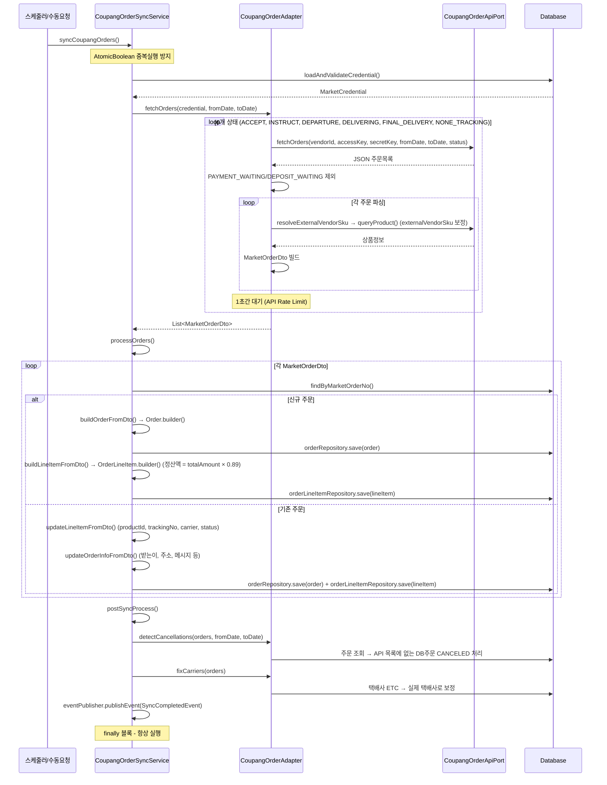

# 쿠팡 주문 동기화 시퀀스

## 트리거 방식
- **스케줄러** (`OrderSyncScheduler.syncCoupangOrders()` → `@Scheduled(cron = "0 5/30 * * * ?")`, 현재 비활성화)
- **수동** (`POST /api/v1/orders/sync/coupang` — `OrderSyncController`)

