# OrderController API 시퀀스 다이어그램

> 기준일: 2026-06-16
> API Base URL: `/api/v1/orders`

---

## 1. 주문 목록 검색

```
GET /api/v1/orders?marketTypes=COUPANG&keyword=홍길동&page=0&size=20
```

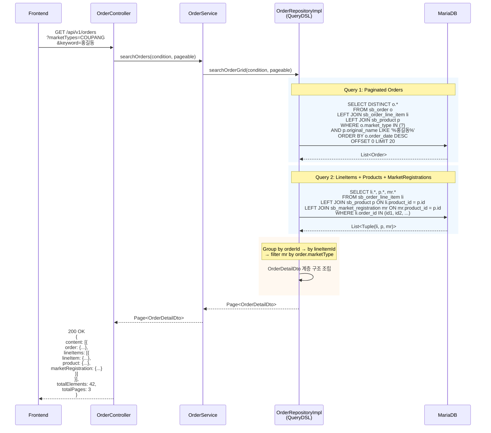

---

## 2. 주문 정보 수정

```
PATCH /api/v1/orders/{id}
RequestBody: { recipientName, recipientPhone, zipcode, address, message, customsClearanceNo, customsStatus }
```

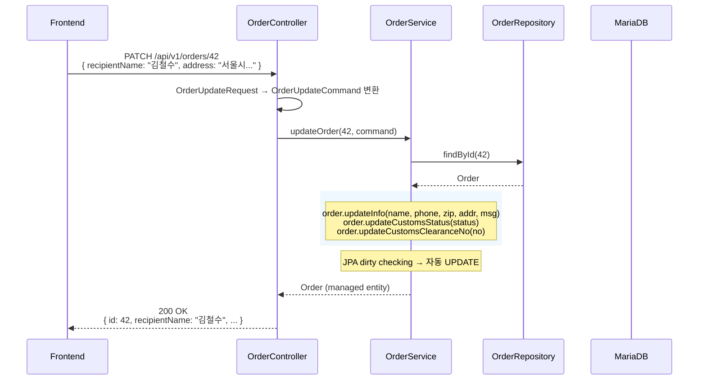

---

## 3. 라인아이템 수정

```
PATCH /api/v1/orders/line-items/{id}
RequestBody: { trackingNo, shippingCarrier, settlementAmount, sourcingAccount, ... }
```

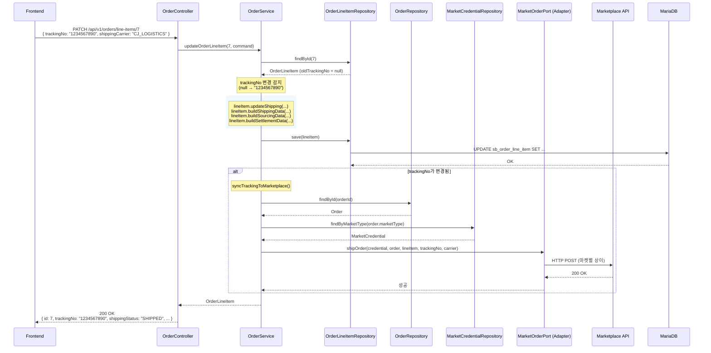

---

## 4. 주문 삭제

```
DELETE /api/v1/orders/{id}
```

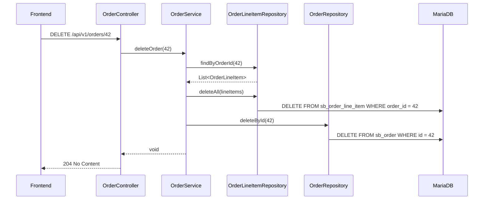

---

## 5. 일괄 출고처리

```
POST /api/v1/orders/ship
RequestBody: { orderIds: [42, 43, 44] }
```

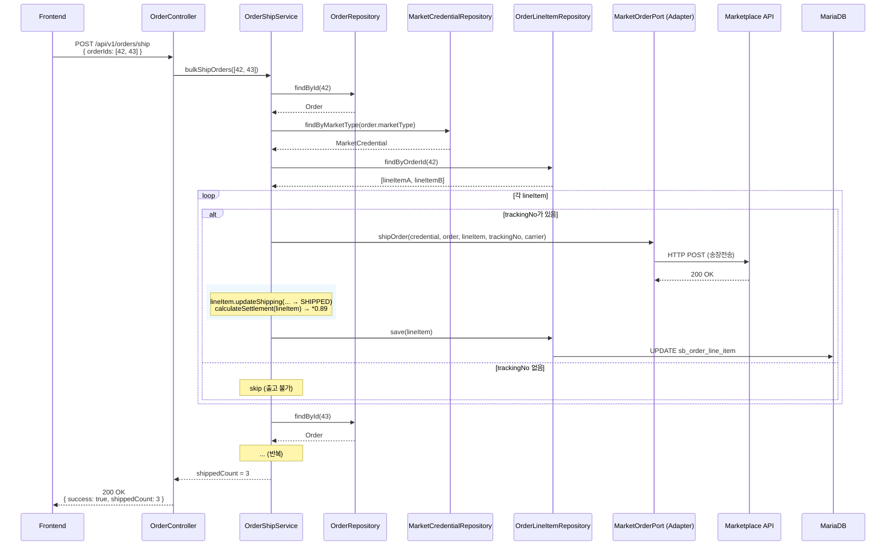

---

## 6. 주문 확정

```
POST /api/v1/orders/{id}/confirm
```

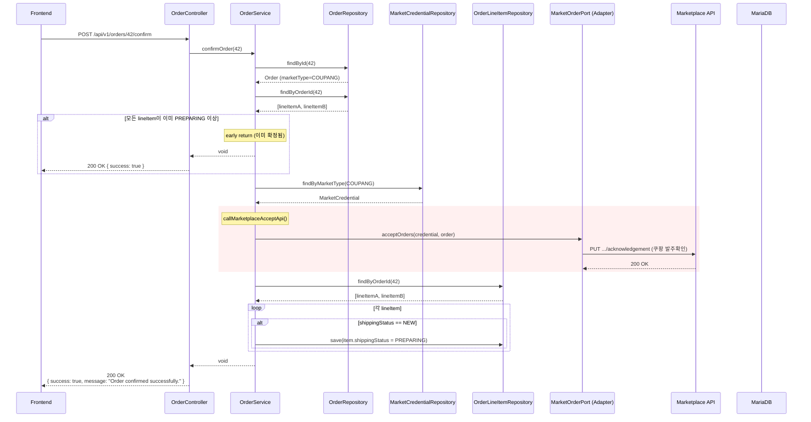

---

## 7. 일괄 주문 확정

```
POST /api/v1/orders/confirm/batch
RequestBody: { orderIds: [42, 43, 44] }
```

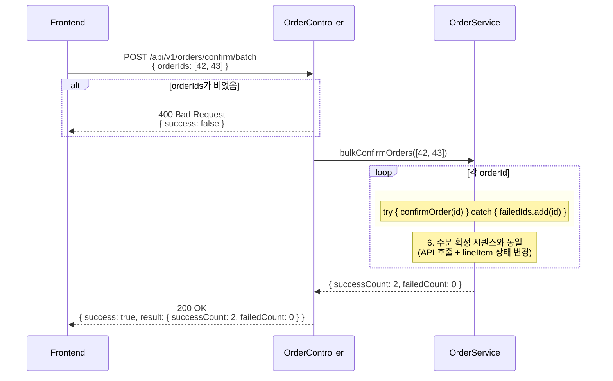

---

## 8. 주문 취소

```
POST /api/v1/orders/{id}/cancel
```

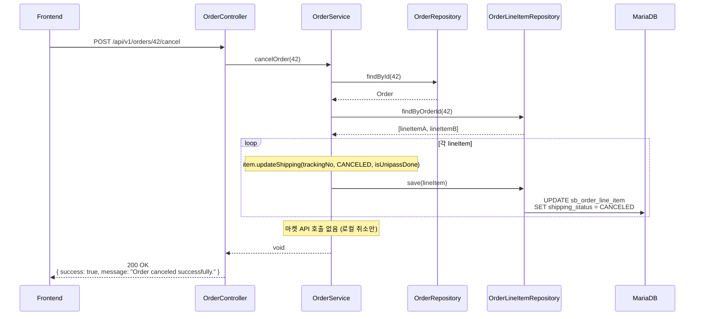

---

## 9. 구매 처리 (PREPARING → PURCHASED)

```
POST /api/v1/orders/line-items/{lineItemId}/purchase
RequestBody: { sourcingAccount, sourcingOrderNo, discountCode, sourcingVendor }
```

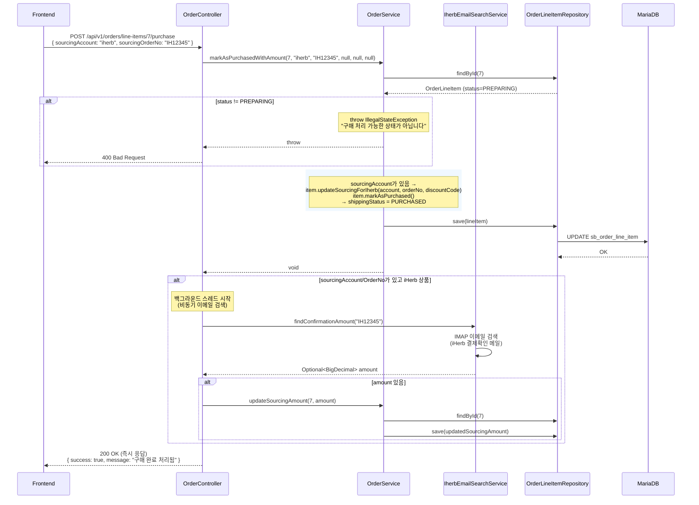

---

## 10. 배송 처리 (PURCHASED → SHIPPED)

```
POST /api/v1/orders/line-items/{lineItemId}/ship
RequestBody: { trackingNo, carrier }
```

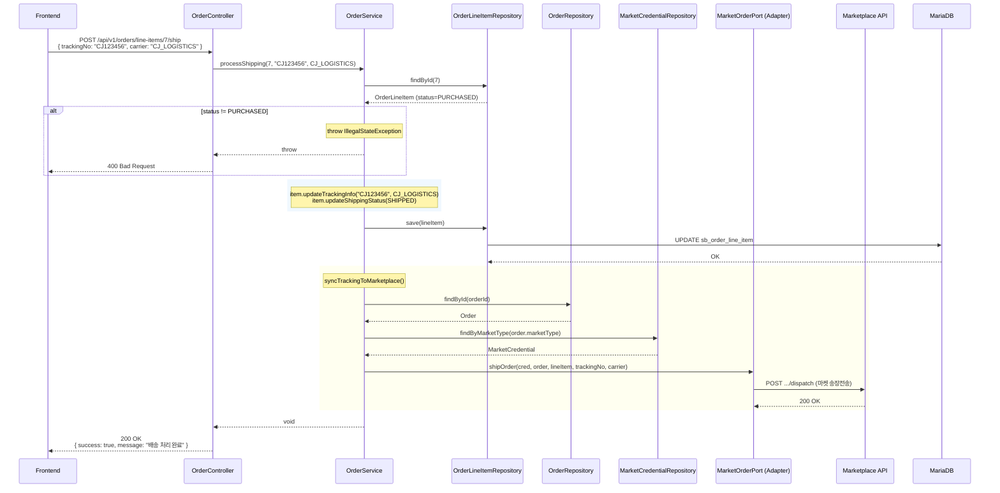

---

## 11. 송장 수정 (SHIPPED 상태)

```
PUT /api/v1/orders/line-items/{lineItemId}/tracking
RequestBody: { trackingNo, carrier }
```

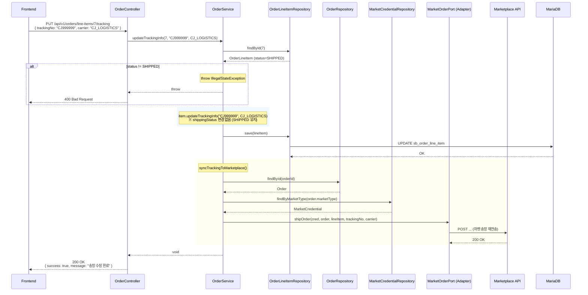

---

## ShippingStatus 생명주기

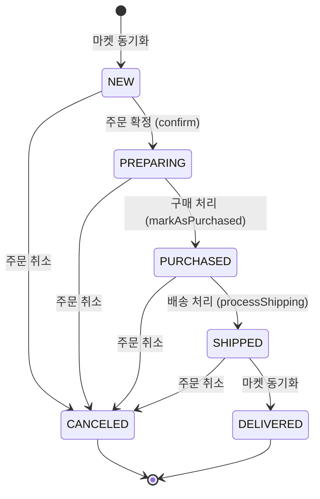

---

## 전체 API 요약

| # | Method | URL | Controller Method | Service Method |
|---|--------|-----|-------------------|----------------|
| 1 | `GET` | `/api/v1/orders` | `getOrders()` | `OrderService.searchOrders()` |
| 2 | `PATCH` | `/api/v1/orders/{id}` | `updateOrder()` | `OrderService.updateOrder()` |
| 3 | `PATCH` | `/api/v1/orders/line-items/{id}` | `updateOrderLineItem()` | `OrderService.updateOrderLineItem()` |
| 4 | `DELETE` | `/api/v1/orders/{id}` | `deleteOrder()` | `OrderService.deleteOrder()` |
| 5 | `POST` | `/api/v1/orders/ship` | `shipOrders()` | `OrderShipService.bulkShipOrders()` |
| 6 | `POST` | `/api/v1/orders/{id}/confirm` | `confirmOrder()` | `OrderService.confirmOrder()` |
| 7 | `POST` | `/api/v1/orders/confirm/batch` | `bulkConfirmOrders()` | `OrderService.bulkConfirmOrders()` |
| 8 | `POST` | `/api/v1/orders/{id}/cancel` | `cancelOrder()` | `OrderService.cancelOrder()` |
| 9 | `POST` | `/api/v1/orders/line-items/{lineItemId}/purchase` | `markLineItemPurchased()` | `OrderService.markAsPurchasedWithAmount()` |
| 10 | `POST` | `/api/v1/orders/line-items/{lineItemId}/ship` | `processShipping()` | `OrderService.processShipping()` |
| 11 | `PUT` | `/api/v1/orders/line-items/{lineItemId}/tracking` | `updateTrackingInfo()` | `OrderService.updateTrackingInfo()` |
