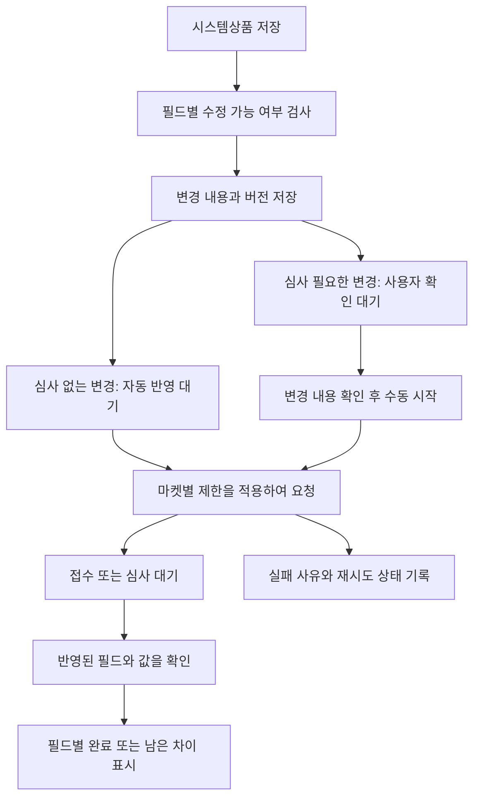

# 상품 관리 — 검색·필터 및 화면 구성 초안

작성일: 2026-09-05. 기반: [요구사항 및 Q&A 기록](2026-09-05-products-redesign-discovery.md).

Q1~Q6의 검색·필터 범위, 기본 정렬, 판매가 표시, 심사 변경과 자동 반영 정책이 확정되었다. 아래 배치와 미결정 세부 동작·데이터 계약은 검토안이다. [가상 데이터로 보는 클릭 시안](2026-09-05-products-workspace-preview.html)은 운영 기능 구현이 아니며 외부 요청 없이 동작한다.

## 1. 화면 구성 제안

| 영역 | 사용자에게 제공할 것 |
| --- | --- |
| 검색 | 전체 검색 필드에 대한 통합 검색, 여러 SB코드 붙여넣기, 검색 조건 요약 |
| 빠른 보기 | 전체, 반영 필요, 반영 실패, 오래된 콘텐츠, 미등록 마켓이 있는 상품 |
| 필터 | 소싱처·브랜드·재고상태를 쉽게 선택. 마켓별 등록/미등록과 콘텐츠 갱신 조건을 추가 |
| 적용 조건 | 현재 적용 중인 조건을 칩으로 표시하고 개별 해제. 자주 쓰는 조합 저장 제안 |
| 상품 그리드 | 요구된 업무 필드와 마켓별 상태. 기본 정렬은 조치 필요 → 갱신 오래된 순 |
| 선택 작업 | 선택 건수, 일괄 편집, 가격·재고 수집, 이미지·상세 수집, 마켓 반영, 미등록 마켓 등록 |
| 상품 편집 | 그리드 위치와 검색 조건을 유지한 상세 패널 제안. 잠금 사유, 변경 내용, 마켓 결과·재시도 확인 |
| 작업 진행 | 실행 중·심사 대기·반영 확인·부분 실패 등을 상품과 마켓 단위로 확인 |

Q4 확정: 기준가는 그리드에 표시하고 펼치면 마켓별 판매가·반영 차이·마지막 조회 시각을 보여준다. 상품명 링크의 목적지가 소싱처 원문인지 다른 상품 페이지인지는 다음 화면 Q&A에서 확인한다.

### 정보의 우선순위

- 상품 식별: 체크박스, 썸네일, SB코드, 브랜드, 상품명.
- 상품 업무값: 카테고리, 소싱처, 판매가, 재고, 묶음수량.
- 관리 현황: 마켓별 등록·판매·정보 반영 상태, 콘텐츠 갱신 시각, 다음 조치.
- 색상만으로 상태를 전달하지 않고 ‘반영 필요’, ‘실패’, ‘심사중’, ‘미등록’ 등의 짧은 문구와 아이콘을 함께 표시한다는 제안.
- 마켓 상태를 클릭하면 해당 상품·마켓의 실제 확인 시각, 차이, 실패 원인, 가능한 작업을 보여주는 구성 검토.

## 2. 통합 검색과 SB코드 붙여넣기

확정 검색 범위: 상품명, SB코드, 브랜드, 바코드, 소싱처 상품번호, 마켓 상품번호.

### 입력 예시

아래 코드는 검색 동작을 설명하는 가상 값이다.

```text
SB-DEMO-001, SB-DEMO-002
SB-DEMO-003
```

처리 제안:

1. 여러 SB코드 입력은 쉼표·LF·CRLF를 지원하고 혼합 입력도 처리한다.
2. 앞뒤 공백과 빈 항목을 제거하고 같은 코드는 중복 제거한다. 선행 0을 보존하며 숫자로 변환하지 않는다.
3. 코드는 정확히 일치하는 상품을 조회한다. 붙여넣기를 일반 상품명의 쉼표와 혼동하지 않도록 ‘여러 SB코드’ 입력 영역과 인식 결과를 제공하는 방식 검토.
4. 입력 개수·유효한 고유 코드 개수·현재 조건에서 찾은 개수를 구분해서 표시한다. 누락이나 중복을 조용히 버리지 않는다.
5. 다른 필터와 함께 적용할 때는 ‘존재하지 않는 코드’와 ‘존재하지만 필터에서 제외된 코드’를 구분한다.
6. 조회한 상품을 자동으로 작업 대상으로 체크하지 않는다. 검색과 일괄 작업 선택을 별도 동작으로 유지하는 안이다.

일반 문자열 검색은 부분 일치, 상품번호 검색은 정확 일치 중심의 규칙을 검토한다. 원문명·기본명을 상품명 검색 범위에 포함하는 방식, 대소문자 정규화, 최대 입력 개수·오류 표시는 이후 세부 계약에서 명시한다.

## 3. 필터 조합 제안

같은 필드 안에서 선택한 여러 값은 OR, 서로 다른 필드는 AND로 결합하는 구조를 제안한다. 마켓 조건은 마켓과 상태를 한 쌍으로 묶어 여러 조건을 동시에 지정한다.

| 화면 조건 | 백엔드가 판정해야 하는 의미 |
| --- | --- |
| 소싱처 IHB 또는 AMZ + 브랜드 A 또는 B | 소싱처 집합에 속하고 브랜드 집합에도 속하는 상품 |
| IHB + 재고 있음 + 쿠팡 등록 + 11번가 미등록 | 위 네 조건을 모두 충족. 상품 번호나 등록행이 남아 있다는 이유만으로 활성 등록으로 판단하지 않음 |
| 어느 마켓이든 반영 실패 | 관련 마켓 중 미해결 반영 실패가 하나 이상인 상품. 해결된 과거 실패 기록은 별도 이력 검색 |
| 이미지·HTML 90일 경과 | 대표·부가 이미지 및 HTML의 갱신 이력으로 판단. 둘 중 하나/둘 모두 선택 방식 제안 |
| 특정 마켓 미등록 | 해당 마켓의 미등록 상태만 판정. API 조회 실패로 상태를 모르는 상품은 미등록으로 오분류하지 않음 |

브랜드 필터는 검색 가능한 다중 선택 방식 제안. 레거시 브랜드 표기의 통합 여부는 별도 데이터 정리 문제로 다루고 필터 구현 중 임의 병합하지 않는다.

‘재고 있음/품절’과 마켓의 ‘판매중/판매중단’은 다른 필터다. 재고를 조회하지 못한 상태를 품절로 추측하지 않는다.

Q9 확정: 과거 삭제 건도 등록 후보에 포함하고 삭제 사유 확인 후 선택 등록한다. Q8의 영구 판매금지 이력은 별도 원인으로 표시하고, 연결 해제만으로 자동 재등록하지 않는다. 후보 표시와 실행 가능 조건은 구분한다.

## 4. 기본 정렬과 콘텐츠 날짜

확정: 조치 필요 상품 우선 → 정보 갱신이 오래된 순.

추가 정의가 필요한 부분:

- 조치 필요의 세부 우선순위. 실패·정책 차단·삭제 확인·정보 불일치·콘텐츠 오래됨을 어떻게 묶을지 시안으로 검토.
- 정상 품절 상품 또는 미등록 마켓이 있다는 이유만으로 모든 상품을 긴급 조치 대상으로 올리지 않는 안.
- 어떤 정보의 갱신일을 보조 정렬에 사용할지. 가격·재고를 오늘 확인했다고 1년 된 이미지가 최신으로 정렬되면 안 됨.
- 갱신 이력이 없는 상품의 위치 및 표시. ‘미확인’을 날짜가 있는 상품과 구분하며 기준일을 임의 채우지 않음.
- 동일 조건의 상품 순서가 흔들리지 않도록 마지막 보조 정렬에 안정적인 상품 식별자를 사용.

콘텐츠별로 마지막 수집 시도, 성공 확인, 내용 변경, 시스템 적용을 구분하는 데이터 모델을 검토한다. 소싱처를 다시 확인했으나 내용이 동일한 경우도 확인 성공으로 기록할 수 있어야 한다. ‘90일’은 필터 값으로 지원하며 전체 시스템의 자동 실행 주기나 전역 노후 기준으로 확정하지 않는다.

정렬은 현재 페이지의 행에만 적용하지 않고 서버 전체 검색 결과에 적용한다. 기존 정렬 후보의 오름/내림차순·다중 정렬은 화면 검토 후 범위를 확정한다.

## 5. 백엔드에 필요한 조회 계약 — 초안

| 관심사 | 필요한 데이터/처리 |
| --- | --- |
| 검색 입력 | 일반 검색어와 구조화한 SB코드 목록을 구분. 입력 검증·중복 제거·조회 결과 요약 |
| 필터 입력 | 소싱처 집합, 브랜드 집합, 재고 상태, 마켓별 등록 조건, 어느 마켓이든 실패, 콘텐츠 종류별 경과일 |
| 목록 응답 | 묶음수량, 재고 수량/상태, 마켓별 존재/판매/반영 상태, 확인 시각, 콘텐츠 갱신 이력 추가 |
| 식별자 검색 | 소싱처별 상품번호, 마켓별 판매자상품/노출상품/옵션 번호의 검색 대상 정의. 서로 다른 마켓에서 같은 번호가 나올 수 있음을 고려 |
| 전체 결과 정렬 | 조치 필요 여부와 날짜를 서버에서 판정. 고유한 보조 정렬을 포함 |
| 필터 선택값 | 실제 브랜드·소싱처 선택값과 검색 가능 목록. 미지정 값의 포함/제외 표현 |
| 성능 | 일반 목록 조회 때 외부 마켓을 상품마다 실시간 호출하지 않는 안. 저장된 관측값과 확인 시각 사용, 필요 시 별도 확인 작업 |
| 일괄 선택 | 명시적 상품 ID와 검색 결과 전체 선택을 구분. 실행 전 확정한 대상이 이후 필터 변화로 바뀌지 않도록 설계 |

엔드포인트 경로·DTO 이름·DB 마이그레이션·인덱스는 아직 확정하지 않는다. 검색 API의 입력과 일괄 실행 대상은 같은 조건 해석을 사용해야 한다.

## 6. 추가 코드 조사 결과

- `ProductSearchCondition`에는 브랜드 조건·여러 SB코드·마켓별 혼합 등록 조건이 없다. Q1~Q2를 충족하려면 조회 계약 확장이 필요하다.
- `ProductRepository.findBySbCodeIn`은 존재하지만 상품 목록 검색 경로에 연결되어 있지 않다.
- `SourcingInfo`에는 소싱처 상품번호 전용 속성이 없고 소싱 URL만 있다. 확인한 `VendorProductIdExtractor`는 iHerb URL ID 추출만 지원한다. 다른 소싱처 상품번호 저장·추출 경로의 추가 조사가 필요하며 URL 패턴을 추측하여 번호를 만들지 않는다.
- `MarketRegistration.marketIdentifiers`에는 마켓별 여러 식별자가 JSON 문자열로 저장된다. G마켓·옥션 식별자는 카페24 연결정보 안에도 있다. 검색과 필터 판정에서 해당 구조를 고려해야 한다.
- `PriceInfo`는 DB 기준가 외에도 원가·환율·배송비·마진·쿠폰·최소마진을 보유한다. Q4에 따른 가격 표시는 정책으로 산출한 마켓별 목표가와 마지막 관측 판매가를 구분해야 한다.

## 7. 저장과 마켓 반영 — Q5·Q6을 적용한 설계 초안

| 상황 | 화면·백엔드의 필요한 동작 |
| --- | --- |
| 시스템상품 저장 | 변경 필드와 버전 기록. 저장 완료와 외부 반영 완료를 구분 |
| 심사 없는 수정 | 커밋된 변경을 자동 반영 작업으로 전달. 수동 버튼에서도 같은 작업 경로 사용 |
| 심사 필요 수정 | DB 저장 허용. 마켓별 변경 내용과 영향 확인 후 사용자가 수동 시작 |
| 같은 상품에 두 종류의 변경 | 자동 반영 가능한 변경과 심사 대기 변경을 각각 추적. 가격 반영만 완료했다고 상품명까지 일치로 표시하지 않음 |
| 전체 수정 요청을 요구하는 마켓 | 최신 마켓 원본에 자동 반영이 허용된 변경만 병합. 아직 사용자가 승인하지 않은 심사 필요 변경이 함께 전송되지 않도록 보장 |
| 사용자 확인 후 추가 편집 | 확인한 변경 스냅샷/버전으로 요청. 확인하지 않은 새 값까지 수동 심사 요청에 포함하지 않음 |
| 동일 필드에 새 변경 발생 | 과거 작업 결과를 최신 값의 성공으로 기록하지 않음. 다음 반영 대상과 남은 차이를 보존 |
| 응답 접수·심사 대기 | 마켓별 접수/심사 상태 표시. 적용값을 검증하기 전 전체 동기화 완료로 표시하지 않음 |
| 일부 필드 실패 | 미반영 필드·사유·가능한 재시도 방법 표시. 해결된 오류가 새 결과를 가리지 않도록 이력 분리 |

아래 다이어그램의 내부 단계 명칭과 작업 저장 스키마는 설계 제안이다.



구현 시 필드별 허용 여부는 마켓·상품 유형·상태에 대한 API 조사 결과로 판정한다. 표나 시안에 등장하는 가상 예시는 특정 마켓의 모든 필드 지원을 보장하지 않는다.

## 8. 콘텐츠 및 연결 상태 — 추가 조사

- 기존 이미지 교체기는 HTML의 이미지 URL에 SB코드가 포함된 태그를 찾아 교체한다(`HtmlImageReplacer`). 매칭이 없는 레거시 HTML의 본문·이미지 갱신은 이 경로만으로 보장되지 않는다.
- 신규 상세 생성기는 제품 설명·성분·사용법·주의 사항과 공통 문구를 조립한다(`DetailHtmlBuilder`). Q7 설명에서 사용자는 이미지·상품명·묶음수량 등을 조합해 자동 처리해 왔다고 확인했다. 수동 작성 영역이 있다는 전제는 제거하고, Q11에서 최신 공통 템플릿으로 통일하고 기존/최신 비교 후 선택 반영하기로 확정했다.
- 기존 등록 프로브는 미분류 미동기화 등록행을 조회하는 경로다(`MarketRegistrationProbeService`). 모든 활성 연결에 대한 정기 판매상태 확인을 이 코드가 수행한다고 단정할 수 없다.
- 기존 존재 상태는 PRESENT/ABSENT/UNKNOWN이며 판매상태와 정보 일치 상태를 제공하지 않는다(`MarketPresence`). 또한 범용 오류 문자열을 삭제 판정에 사용하는 경로가 있어, 마켓별 상품 부재 근거와 일반 HTTP 오류를 구분하도록 재검토해야 한다.

### 사용자 설명에 따른 연결 정책

| 확인된 상태 | 연결과 후속 처리 |
| --- | --- |
| 일시 품절 | 정상 연결 유지. 영구 차단으로 취급하지 않음. Q10: 판매용 수량 별도 관리, 소싱처 품절 시 판매 중지·재입고 시 복구 |
| 규칙 위반 등에 따른 영구 판매금지 | 활성 연결 해제, 자동 동기화 대상에서 제외. 기존 마켓 상품번호와 금지 사유·확인 근거는 이력 보관 |
| 삭제 확정 | 활성 연결 해제. 과거 삭제 이력을 등록 후보에 포함하고 사유 확인 후 선택 재등록 |
| 상태나 원인 미확인 | 품절/영구금지/삭제로 추측하지 않고 확인 필요 표시. 원인 판정을 위한 조회와 상품 쓰기 작업을 구분 |

## 9. 추가 확정 정책과 남은 설계

Q10 판매용 수량 별도 관리와 품절/재입고 연동, Q11 최신 공통 템플릿의 비교·선택 반영, Q12 소싱처 원본 상품 새 탭 링크가 확정됐다. 행 간격도 촘촘하게 기본, 넓게 보기 전환으로 확정했다. 코드와 마켓 원문을 대조한 결과 및 백엔드 구성은 [필드 규칙 및 동기화 설계](2026-09-05-products-field-rules-and-sync-design.md)에 기록한다.

Q14에서 판매용 수량 기본 300개, Q15에서 활성 연결이 모두 해제되면 편집 허용·과거 값과 해제 사유 이력 보존을 확정했다. API별 상태 판정·필드 매핑과 일괄 편집 세부 동작은 별도 확인한다.

클릭 시안은 별도 임시 프로필의 헤드리스 크롬(1600×1100)에서 초기 화면 렌더링을 확인했다. JS 문법·요소 ID·외부 리소스 부재·문서 링크도 확인했다. 모든 클릭 흐름과 반응형 화면의 브라우저 자동 검증을 마친 것은 아니다.
