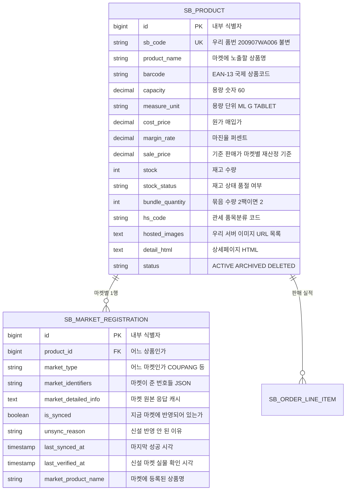
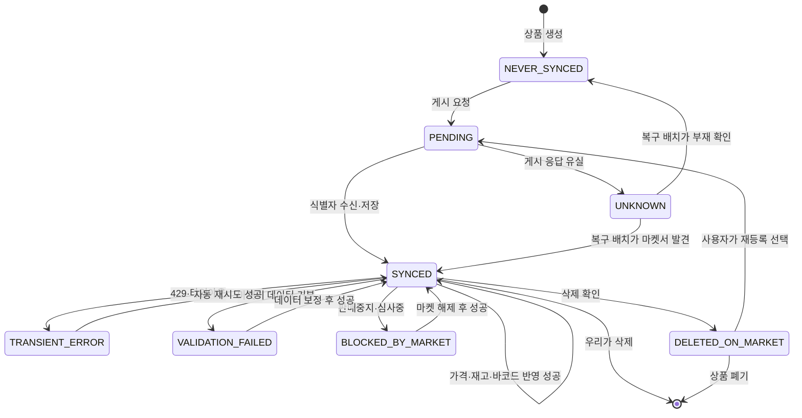
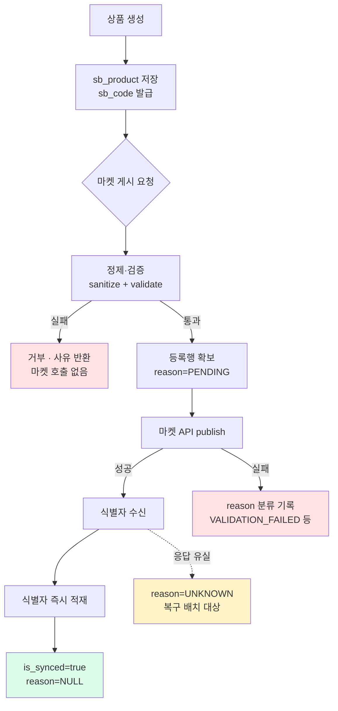
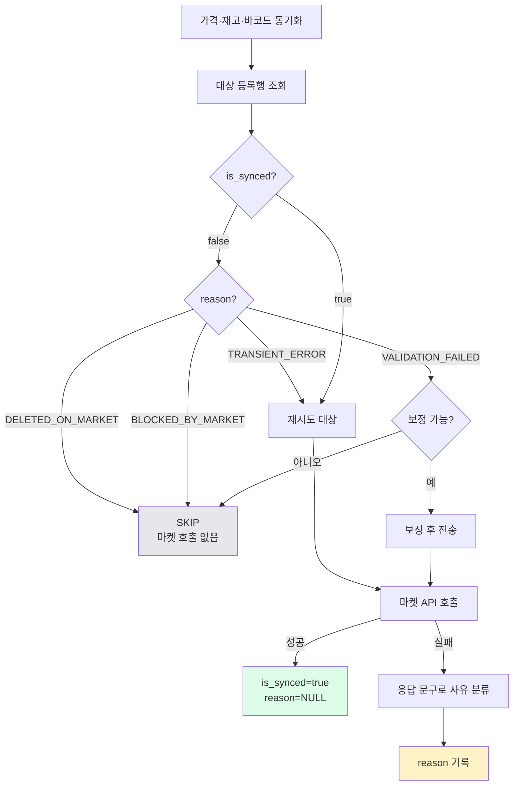
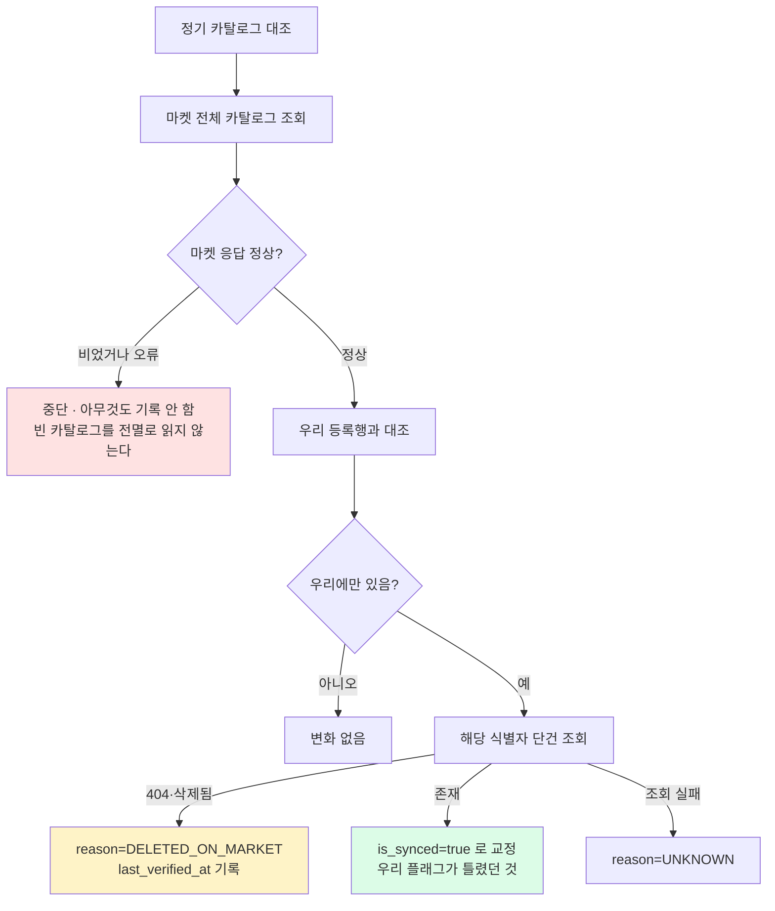
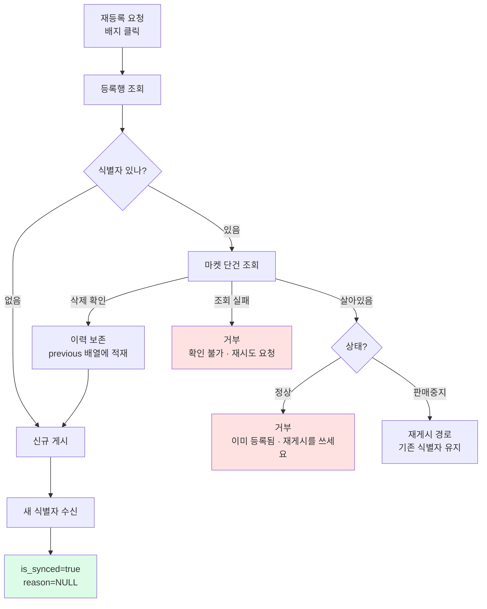
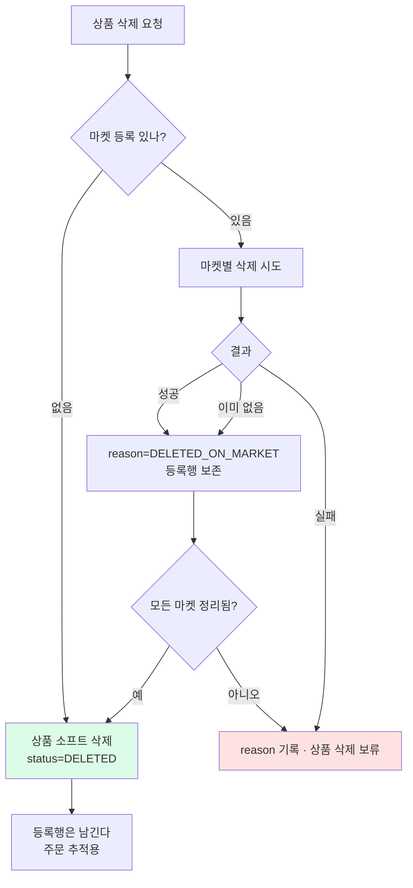
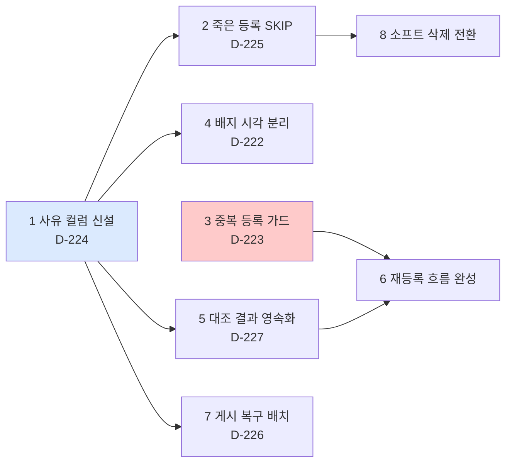

# 상품 생명주기 — 목표 아키텍처

작성 2026-08-29. [[product-lifecycle]] 이 **현재 무엇이 잘못됐는지**를 다뤘다면, 이 문서는 **고친 뒤 어떻게 흘러야 하는지**를 정의한다.

---

## 0. 설계 원칙 네 가지

이 문서의 모든 결정은 아래 네 문장에서 나온다.

**① 상태와 사유를 분리한다.**
"동기화됐는가"(boolean)와 "왜 안 됐는가"(enum)는 다른 정보다. 하나로 뭉치면 대응을 정할 수 없다.

**② 식별자는 지우지 않는다.**
마켓 상품번호는 과거 주문 추적·정합성 대조·이력의 근거다. 삭제된 리스팅의 번호도 남긴다. 지우면 문제가 사라지는 게 아니라 보이지 않게 된다.

**③ 쓰기 전에 존재를 확인한다.**
"우리 DB 가 그렇다고 하니까"로 마켓에 쓰지 않는다. 되돌리기 어려운 쓰기(신규 등록)일수록 마켓 실물을 먼저 조회한다.

**④ 모르면 모른다고 기록한다.**
조회 실패를 "없음"으로 단정하지 않는다. `UNKNOWN` 은 유효한 상태다.

---

## 1. 데이터 모델

### 1.1 ER 다이어그램

상품 하나(`SB_PRODUCT`)가 여러 마켓에 등록되고, 그 등록 상태를 마켓별로 한 행씩(`SB_MARKET_REGISTRATION`) 관리한다. 주문 품목은 상품을 참조한다.



**필드 부연**

| 필드 | 왜 있나 |
|---|---|
| `sb_code` | 우리가 부여하는 품번. **한 번 정해지면 안 바뀐다.** 마켓 상품번호가 바뀌어도 이건 그대로라, 마켓을 넘나드는 기준점이 된다 |
| `sale_price` | **기준가일 뿐 실제 판매가가 아니다.** 마켓마다 수수료가 달라 `MarketSalePriceResolver` 가 마켓별로 다시 계산한다 |
| `bundle_quantity` | "2팩", "3개입" 같은 묶음 수. 쿠팡 옵션명·단위가격 계산에 쓰인다 |
| `market_identifiers` | 마켓이 발급한 번호들의 JSON. **마켓마다 키가 다르다** (아래 표 참조) |
| `market_detailed_info` | 마켓에서 받은 원본 응답을 통째로 캐시. 재게시할 때 "지금 마켓에 뭐가 들어있나"의 출발점 |
| `is_synced` | **현재** 마켓에 반영되어 있는가. 과거가 아니라 지금 |
| `unsync_reason` | ★신설. `is_synced=false` 일 때 **왜** 그런지 |
| `last_verified_at` | ★신설. 마켓에 실제로 조회해서 존재를 확인한 시각. `last_synced_at`(우리가 쓴 시각)과 다르다 |

**`market_identifiers` 의 마켓별 키** — 같은 컬럼인데 내용이 마켓마다 다르다.

| 마켓 | 키 | 뜻 |
|---|---|---|
| 쿠팡 | `sellerProductId` | 판매자 상품번호 (수정·삭제의 기준) |
| 쿠팡 | `vendorItemId` | 옵션 번호 (주문 매칭·재고의 기준) |
| 쿠팡 | `productId` | 노출 상품번호 (고객이 보는 페이지) |
| 스토어 | `originProductNo` | 원상품 번호 (수정의 기준) |
| 스토어 | `channelProductNo` | 채널 상품번호 (고객이 보는 페이지) |
| 11번가 | `prdNo` | 상품 번호 |
| 카페24 | `product_no` | 상품 번호 |
| 카페24 | `product_code` | 상품 코드 (P0000NXG 형태) |

**이 다양성이 여러 사고의 원인이었다.** 어느 키로 조회해야 하는지 마켓마다 달라서, 잘못된 키로 매칭하면 엉뚱한 상품이 걸린다(D-218 오배송이 이 계열이었다).

### 1.2 신설 컬럼 — `unsync_reason`

`is_synced=false` 하나에 뭉쳐 있던 상황을 갈라낸다.

| 값 | 의미 | 사용자에게 필요한 조치 | 자동 처리 |
|---|---|---|---|
| `NEVER_SYNCED` | 아직 한 번도 게시 안 됨 | 최초 등록 | 없음 |
| `PENDING` | 게시 요청 직후, 결과 미확정 | 대기 | 복구 배치가 화해 |
| `TRANSIENT_ERROR` | 429·타임아웃·순단 | 없음 | **자동 재시도** |
| `VALIDATION_FAILED` | 마켓이 데이터를 거부(고시정보 결손 등) | 데이터 수정 | 보정 가능하면 자동 |
| `DELETED_ON_MARKET` | 마켓에서 삭제 확인됨 | **재등록 결정** | 없음 (사람 판단) |
| `BLOCKED_BY_MARKET` | 판매중지·심사중·게이팅 | 마켓 문의 | 없음 |
| `UNKNOWN` | 조회 실패로 판정 불가 | 재확인 | 다음 대조에서 재판정 |

`is_synced=true` 이면 `unsync_reason` 은 항상 `NULL` 이다. 둘은 함께 갱신된다.

---

## 2. 등록 상태의 변화 (상태 기계)

### 2.1 "상태 기계"가 뭔가

**하나의 등록행이 가질 수 있는 상태들과, 어떤 사건이 일어나면 어느 상태로 옮겨가는지를 그린 지도**다. 프로그래밍 용어지만 뜻은 단순하다 — "지금 이 상태에서 무슨 일이 생기면 어디로 가는가"를 빠짐없이 정해두는 것이다.

이걸 그리는 이유는 **빠진 경우를 찾기 위해서**다. 예를 들어 지금 우리 시스템은 "마켓에서 삭제됨" 상태가 아예 없어서, 삭제된 상품과 잠깐 실패한 상품이 같은 칸에 들어가 있다. 지도를 그려보면 그런 구멍이 눈에 보인다.

### 2.2 이 값들이 어디에 저장되나

두 컬럼이 짝으로 움직인다.

```
sb_market_registration.is_synced       boolean   현재 마켓에 반영되어 있는가
sb_market_registration.unsync_reason   varchar   ★신설. 아니라면 왜 아닌가
```

**규칙은 하나다.**
- `is_synced = true` → `unsync_reason` 은 항상 `NULL`
- `is_synced = false` → `unsync_reason` 에 **반드시** 사유가 들어간다

아래 다이어그램의 `SYNCED` 는 `is_synced=true` 를 뜻하고, 나머지는 전부 `is_synced=false` 이면서 `unsync_reason` 값이 다른 상태다.

### 2.3 `unsync_reason` Enum

Java 쪽에 `UnsyncReason` enum 을 만들고 DB 에는 문자열로 저장한다(기존 `MarketType`·`ActionStatus` 와 같은 방식).

```java
public enum UnsyncReason {
    NEVER_SYNCED,        // 아직 한 번도 게시 안 됨
    PENDING,             // 게시 요청 직후, 결과 미확정
    TRANSIENT_ERROR,     // 429·타임아웃·순단 같은 일시 오류
    VALIDATION_FAILED,   // 마켓이 데이터를 거부
    DELETED_ON_MARKET,   // 마켓에서 삭제 확인됨
    BLOCKED_BY_MARKET,   // 판매중지·심사중·게이팅
    UNKNOWN              // 조회 실패로 판정 불가
}
```

### 2.4 상태 지도



### 2.5 상태별 상세

| 상태 | `is_synced` | 실제로 무슨 일이 있었나 | 누가 해결하나 | 실제 사례 |
|---|---|---|---|---|
| `SYNCED` | `true` | 마켓에 정상 등록·반영됨 | — | 정상 상품 대부분 |
| `NEVER_SYNCED` | `false` | 상품은 만들었지만 이 마켓엔 아직 안 올림 | 사용자가 등록 클릭 | 신규 상품 |
| `PENDING` | `false` | 게시 요청을 보냈고 응답 대기·처리 중 | 자동(잠시 후 확정) | 게시 직후 몇 초 |
| `TRANSIENT_ERROR` | `false` | 마켓 서버가 잠깐 못 받음 | **자동 재시도** | 네이버 `429 GW.RATE_LIMIT` |
| `VALIDATION_FAILED` | `false` | 마켓이 "데이터가 이상하다"며 거부 | 데이터 고치고 재시도 | 소비기한 결손 10건 |
| `DELETED_ON_MARKET` | `false` | 마켓에서 상품이 사라짐 | **사람이 재등록 판단** | 쿠팡 "이미 삭제된 상품입니다" |
| `BLOCKED_BY_MARKET` | `false` | 마켓이 막아둠 | 마켓에 문의 | 쿠팡 "심사가 진행중입니다" |
| `UNKNOWN` | `false` | 조회가 안 돼서 판정 불가 | 다음 대조에서 재판정 | 카탈로그 조회 실패 |

### 2.6 이 지도에서 읽어야 할 것 세 가지

**① `DELETED_ON_MARKET` 에서 `SYNCED` 로 가는 화살표가 없다.**
삭제된 리스팅은 되살아나지 않는다. 마켓에서 지워진 상품에 아무리 수정 요청을 보내도 살아나지 않으므로, 반드시 `PENDING`(= 새로 등록)을 거쳐야 한다. **이 화살표가 없다는 사실 자체가 "죽은 등록에 전송하지 마라"는 규칙의 근거**다(D-225).

**② `TRANSIENT_ERROR` 만 자기 힘으로 `SYNCED` 로 돌아온다.**
일시 오류는 그냥 다시 시도하면 된다. 나머지는 전부 바깥에서 뭔가 바뀌어야(데이터 수정·마켓 해제·사람의 재등록 결정) 돌아올 수 있다. **자동 재시도를 어디에 걸어야 하는지가 여기서 정해진다.**

**③ `UNKNOWN` 은 막다른 길이 아니다.**
조회 실패는 "없음"이 아니라 "모름"이다. 다음 대조 때 다시 판정해서 `SYNCED` 로 갈 수도, `NEVER_SYNCED` 로 갈 수도 있다. 모르는 것을 단정하지 않는 자리다.

## 3. 흐름 ① 신규 상품 등록



### 3.1 단계별 상세

**A·B — 상품 생성**
`ProductCreateUseCase` 가 `sb_product` 에 1행을 만든다. 이때 `sb_code`(우리 품번)가 발급되고 **이후 절대 바뀌지 않는다.** 이미지는 원본 URL(`source_images`)을 우리 서버로 복사해 `hosted_images` 에 담는다 — 마켓은 외부 URL 을 거부하거나 나중에 링크가 깨질 수 있어서다.

이 시점엔 **아직 어느 마켓에도 올라가지 않았다.** 등록행은 존재하지 않거나 `NEVER_SYNCED` 다.

**D — 정제(sanitize): 마켓이 싫어하는 문자를 없앤다**

`ProductSanitizer.sanitizeForPublish` 가 하는 일은 단순하다.

```java
product.getProductName().replaceAll("[<>\"'&]", "").trim()
product.getBrand().replaceAll("[<>\"'&]", "").trim()
```

상품명과 브랜드에서 **`< > " ' &` 다섯 글자를 지우고 앞뒤 공백을 자른다.**

왜 하필 이 다섯인가 — 마켓 API 는 XML 이나 JSON 으로 데이터를 받는데, 이 문자들이 **문법 기호와 겹친다.** 예를 들어 11번가는 XML 을 쓰는데 상품명에 `<` 가 들어가면 태그 시작으로 오해해 요청 전체가 깨진다. `&` 도 XML 에서 특수 문자의 시작이라 같은 문제를 일으킨다.

**정제는 조용히 값을 바꾼다.** 사용자가 입력한 상품명이 마켓에 그대로 안 올라갈 수 있다는 뜻이라, 어떤 글자가 지워졌는지는 로그로 남길 만하다.

**D — 검증(validate): 없으면 안 되는 것들을 확인한다**

`ProductValidator` 가 7가지를 본다. 하나라도 없으면 **마켓 API 를 아예 호출하지 않고** 거부한다.

| 검사 항목 | 왜 필수인가 |
|---|---|
| `sb_code` | 우리 품번. 이게 없으면 나중에 어느 상품인지 추적 불가 |
| `product_name` | 마켓에 노출될 이름. 빈 값이면 등록 자체가 안 됨 |
| `brand` | 대부분 마켓이 필수로 요구 |
| `sale_price > 0` | 0원이나 음수는 마켓이 거부 |
| `hosted_images` 1장 이상 | 대표 이미지 없이는 등록 불가 |
| `detail_html` | 상세페이지 내용. 빈 값이면 마켓이 거부 |
| `vendor`(소싱처) | 어디서 사오는지. 발주·정산의 근거 |

**여러 항목이 동시에 없으면 한꺼번에 모아서 알려준다** — 하나 고치고 또 실패하는 왕복을 줄이기 위해서다.

```
상품 검증 실패: 상품명 없음, 판매가 없음, 대표 이미지 없음
```

**이 검사가 마켓 호출 앞에 있는 이유**는 요청 한도 때문이다. 어차피 거부될 요청으로 쿠팡·네이버 한도를 쓰면, 정작 필요한 작업이 `429` 로 막힌다.

**E — 등록행 확보**

`(product_id, market_type)` 조합으로 행을 찾고, 없으면 만든다. 이 시점에 `reason=PENDING` 을 기록한다 — **"게시를 시도했다"는 사실을 마켓 호출 전에 남기는 것**이 핵심이다. 이걸 미리 남겨야 F 에서 응답이 유실돼도 흔적이 있다.

**F — 마켓 API 호출**

여기서 실제로 마켓에 상품이 만들어진다. **이 지점부터는 되돌리기 어렵다.** 성공하면 마켓이 상품번호를 발급해준다.

실패하면 응답 문구를 보고 사유를 분류한다(4장의 매핑표). 무엇으로도 분류가 안 되면 `UNKNOWN` 이다 — **추측해서 아무 사유나 넣지 않는다.**

**G·H·I — 식별자 저장**

마켓이 준 번호를 `market_identifiers` 에 넣고 `is_synced=true`, `unsync_reason=NULL` 로 확정한다.

**H 를 G 와 분리한 이유**가 중요하다. 지금 코드는 마켓 호출과 DB 저장이 붙어 있어서, 저장이 실패하면 **마켓엔 상품이 있는데 우리는 번호를 모르는 상태**가 된다(D-226). 식별자를 받자마자 최소한의 형태로 먼저 적재하고, 그다음 등록행을 갱신하면 유실 구간이 줄어든다.

**J — 응답 유실**

네트워크가 끊기거나 타임아웃이 나면 **성공했는지 실패했는지 알 수 없다.** 이때 `UNKNOWN` 으로 두고 복구 배치가 나중에 마켓에 조회해서 판정한다. 여기서 "실패했겠지" 하고 재시도하면 **중복 등록**이 된다.

## 4. 흐름 ② 정기 동기화 — 죽은 등록을 건드리지 않는다

가격이 바뀌거나 재고가 변하면 마켓에 반영해야 한다. 하루에도 여러 번 도는 흐름이라, **불필요한 호출을 줄이는 것이 곧 요청 한도를 지키는 일**이다.



### 4.1 왜 사유를 보고 갈라야 하나

지금은 `is_synced` 를 아예 보지 않고 **모든 등록행에 전송**한다(D-225). 그래서 이런 일이 벌어졌다.

> 바코드 확대 670건 표본에서 쿠팡 실패 64건. 그중 상당수가 **"이미 삭제된 상품입니다"** — 애초에 보내면 안 되는 대상이었다. 실패로 집계됐지만 실은 **대상 아님**이다.

사유별로 갈리면 이렇게 된다.

| 사유 | 처리 | 이유 |
|---|---|---|
| `DELETED_ON_MARKET` | **건너뛴다** | 마켓에 없는데 수정 요청을 보내봐야 거부만 당한다. 호출 낭비 |
| `BLOCKED_BY_MARKET` | **건너뛴다** | 심사중·판매중지는 우리가 뭘 보내도 안 바뀐다. 마켓이 풀어줘야 한다 |
| `TRANSIENT_ERROR` | **재시도** | 잠깐 실패한 것이니 다시 보내면 된다 |
| `VALIDATION_FAILED` | **보정 후 전송** | 데이터가 문제니 고쳐서 보낸다. 자동 보정이 가능한 것만(소비기한·단위가격) |
| `UNKNOWN` | **재시도** | 모르면 일단 시도해보고 응답으로 판정한다 |

**`VALIDATION_FAILED` 의 "보정 가능?" 분기가 오늘 실제로 만든 것이다.** 소비기한 결손 10건, 단위가격 미선택 2건이 여기 해당했고, 자동으로 채워서 전송하니 통과했다.

### 4.2 응답 문구를 사유로 바꾸는 매핑

마켓은 실패 이유를 **한국어 문장**으로 준다. 이걸 사유 enum 으로 옮기는 표가 필요하다.

| 마켓 | 응답 문구 | 사유 | 근거 |
|---|---|---|---|
| 쿠팡 | `이미 삭제된 상품입니다` | `DELETED_ON_MARKET` | 2026-08-29 실측 |
| 쿠팡 | `심사가 진행중입니다` | `BLOCKED_BY_MARKET` | 2026-08-29 실측 |
| 쿠팡 | `유효하지 않은 구매 옵션 값 혹은 단위` | `VALIDATION_FAILED` | D-182·D-183 계열 |
| 쿠팡 | `쿠팡에 의해 판매중지된 상품` | `BLOCKED_BY_MARKET` | D-209 |
| 스토어 | `400 BAD_REQUEST` + `invalidInputs` | `VALIDATION_FAILED` | 소비기한·단위가격 실측 |
| 스토어 | `429 GW.RATE_LIMIT` | `TRANSIENT_ERROR` | 2026-08-29 실측 |
| 공통 | 타임아웃·5xx | `TRANSIENT_ERROR` | — |
| 공통 | **위 어디에도 안 맞음** | `UNKNOWN` | **단정하지 않는다** |

**마지막 줄이 이 표에서 가장 중요하다.** 모르는 문구를 임의로 분류하면 잘못된 자동 처리로 이어진다. 예를 들어 새로운 실패 문구를 `TRANSIENT_ERROR` 로 잘못 넣으면 영원히 재시도만 반복한다. **모르면 `UNKNOWN` 으로 두고 사람이 보게 한다.**

문구는 마켓이 예고 없이 바꾼다. 그래서 이 표는 **코드에 상수로 박지 말고** 조회 가능한 형태로 관리하고, 매핑 실패(=`UNKNOWN`) 건수를 지표로 봐야 한다. 그 수가 늘면 마켓이 문구를 바꿨다는 신호다.

## 5. 흐름 ③ 삭제 감지 — 능동 대조

마켓은 우리에게 "이 상품 지웠어요"라고 알려주지 않는다. **우리가 주기적으로 확인해야** 안다.



### 5.1 왜 두 겹으로 확인하나

**카탈로그에 없다 ≠ 삭제됐다.** 이 둘을 같게 취급하면 사고가 난다.

카탈로그 조회는 페이지를 나눠 받는데, 그 과정에서 빠질 수 있는 경우가 많다.
- 페이징 중 한 페이지가 실패했는데 조용히 넘어감
- 마켓 API 가 특정 상태(판매중지 등)를 목록에서 제외
- 인증이 거부됐는데 빈 목록으로 응답 (11번가 `-997` 이 그랬다)

**이 저장소가 실제로 겪은 사고가 있다.** D-210 에서 11번가 카탈로그가 빈 배열로 왔는데 그걸 "전멸"로 읽어서 **2,286행 전부를 재고 없음으로 표시**했다. 그래서 지금은 `marketTotal == 0 && localTotal > 0` 이면 아예 판정하지 않고 실패로 종결한다.

목표 흐름은 여기서 한 겹 더 간다 — **카탈로그에서 빠진 건에 대해 단건 조회로 확증**한다. 단건 조회가 404 를 주면 그때 비로소 `DELETED_ON_MARKET` 이다.

### 5.2 반대 방향 교정도 한다

단건 조회에서 **상품이 살아있다고 나오면**, 우리 `is_synced=false` 가 틀렸던 것이다. 이 경우 `true` 로 되돌린다.

이게 필요한 이유는 3장에서 봤듯 `is_synced` 가 **"마지막 작업 성공 여부"**라서다. 네트워크 순단 한 번에 `false` 가 되고, 그 뒤 아무도 안 건드리면 영원히 `false` 로 남는다. 실제로 소비기한 10건이 이 상태였다 — 상품은 멀쩡히 마켓에 있는데 우리만 "없다"고 생각하고 있었다.

### 5.3 기본은 읽기 전용

이 대조는 원래 **리포트**(D-210)다. 갑자기 DB 를 쓰기 시작하면 위험하다 — 판정이 틀렸을 때 피해가 크고, 리포트를 돌릴 때마다 데이터가 바뀌면 재현이 안 된다.

그래서 **`persist=true` 옵션을 명시했을 때만** 기록한다. 평소엔 읽기 전용으로 돌려 숫자만 보고, 판정 로직을 충분히 믿게 된 뒤에 쓰기를 켠다.

## 6. 흐름 ④ 재등록 — 중복을 만들지 않는다



### 6.1 지금 무슨 일이 벌어지나 (D-223)

재등록은 **전용 기능이 아니라 최초 등록 함수를 다시 부르는 것**이다. 그런데 `publishToMarket` 에는 "이미 마켓에 있는지" 확인하는 코드가 **한 줄도 없다**(파일 전체에 `isSynced` 참조 0건).

그래서 살아있는 상품에 재등록을 걸면:

```
마켓: 상품 A 판매중 (sellerProductId = 11583638672)
우리: market_identifiers = {"sellerProductId": "11583638672"}

  ↓ 사용자가 배지를 다시 클릭

savePending    → 기존 행을 그대로 재사용 (새로 안 만든다)
client.publish → 마켓에 **완전히 새로운 상품 B 생성** (= 22000000001)
markPublished  → market_identifiers 를 B 로 덮어씀

  ↓ 결과

마켓: 상품 A 와 B 가 **둘 다** 판매중
우리: B 만 안다
      → A 는 우리가 손댈 수 없는 유령 리스팅
      → 같은 상품이 마켓에 두 개 노출
      → A 로 주문이 들어오면 우리 시스템이 매칭 못 함
```

**되돌리기가 어렵다.** A 의 번호를 이미 잃어서 삭제 요청조차 보낼 수 없다. 마켓 관리자 화면에서 사람이 직접 찾아 지워야 한다.

D-215(쿠팡 임시저장 1,029건), D-210("쿠팡 우리에만 101건")이 이 경로로 생겼을 가능성이 있다.

### 6.2 목표 흐름의 판단 규칙

**핵심은 "쓰기 전에 마켓 실물을 본다"**(원칙 ③)이다. 우리 DB 의 `is_synced` 를 믿지 않는다 — 그게 틀릴 수 있다는 걸 이미 확인했다.

| 마켓 조회 결과 | 처리 | 왜 |
|---|---|---|
| **살아있고 정상** | **거부** | 새로 만들면 중복이 된다. 수정하려면 재게시(update)를 써야 한다 |
| **살아있는데 판매중지** | **재게시로 우회** | 상품은 있으니 새로 만들 필요 없다. 기존 식별자를 유지한 채 상태만 바꾼다 |
| **삭제 확인(404)** | **신규 게시** | 진짜 없으니 새로 만드는 게 맞다. 단, 옛 식별자를 이력에 남긴다 |
| **조회 실패** | **거부** | 모르는 상태에서 쓰면 중복 위험. 재시도를 요청한다(원칙 ④) |

"조회 실패 → 거부"가 답답해 보일 수 있지만, **여기서 진행하면 정확히 6.1 의 사고가 난다.** 확인이 안 되는데 새로 만드는 건 도박이다.

### 6.3 식별자 이력 보존

삭제가 확인돼 새로 등록할 때, 옛 번호를 버리지 않고 같은 JSON 안에 쌓는다.

```json
{
  "sellerProductId": "22000000001",
  "vendorItemId": "88000000001",
  "previous": [
    {"sellerProductId": "11583638672",
     "vendorItemId": "73310987596",
     "deletedAt": "2026-03-01",
     "detectedBy": "CATALOG_RECONCILE"}
  ]
}
```

**별도 테이블 없이 기존 컬럼 안에서 해결한다.** 스키마 변경 없이 되고, 조회할 때 한 번에 딸려 온다.

이게 필요한 이유는 **과거 주문 때문**이다. 옛 리스팅(`11583638672`)으로 팔린 주문은 계속 남아 있고, 반품·정산 문제가 몇 달 뒤에 생길 수 있다. 그때 "이 번호가 우리 어느 상품이었나"를 되짚으려면 이력이 있어야 한다. D-218 오배송 사고가 바로 이 매칭이 틀려서 났다.

## 7. 흐름 ⑤ 상품 폐기



### 7.1 지금과 무엇이 다른가

현재 `ProductDeleteTxService.deleteWithRegistrations` 는 이렇게 한다.

```java
marketRegistrationRepository.deleteAll(registrations);   // 등록행 전부 삭제
productWriter.delete(product);                           // 상품도 삭제
```

**둘 다 DB 에서 완전히 지운다(하드 삭제).** 그러면 이런 게 함께 사라진다.

- 이 상품이 어느 마켓에 어떤 번호로 있었는지
- 언제 등록됐고 언제 삭제됐는지
- **과거 주문이 참조할 마켓 식별자**

마지막 항목이 위험하다. 주문 테이블은 마켓 상품번호로 우리 상품을 찾는데, 등록행이 사라지면 **그 연결이 끊긴다.** D-218 오배송 사고가 상품 매칭 실패에서 났다는 걸 생각하면, 매칭 근거를 스스로 지우는 셈이다.

### 7.2 소프트 삭제로 바꾼다

- **상품**: `status = DELETED` 로 표시만 하고 행은 남긴다. 조회에서 기본 제외한다
- **등록행**: 지우지 않고 `unsync_reason = DELETED_ON_MARKET` 으로 사유만 바꾼다

`sb_product.status` 컬럼이 이미 `ACTIVE / ARCHIVED / DELETED` 를 받게 되어 있다(현재 전부 `ACTIVE`). **스키마를 바꾸지 않고도 전환 가능하다.**

### 7.3 마켓 삭제가 실패하면 상품을 지우지 않는다

순서가 중요하다. **마켓에서 먼저 내리고, 그다음 우리 DB 를 정리한다.**

반대로 하면 마켓에 상품이 남았는데 우리는 그 사실을 모르는 상태가 된다 — 주문이 들어와도 처리할 수 없고, 재고·가격도 관리 못 한다. 그래서 한 마켓이라도 삭제에 실패하면 **상품 삭제를 보류**하고 사유를 남긴다.

"이미 없음"(404)은 성공으로 친다. 목표가 "마켓에 없는 상태"이고 이미 달성됐기 때문이다.

### 7.4 언제 진짜로 지우나

보존기간 정책이 필요하다. 최소한 **관련 주문의 반품·정산이 모두 끝난 뒤**여야 한다. 이 부분은 이 문서에서 정하지 않고, 전환 착수 시 별도로 합의한다.

## 8. 화면 표현

배지는 **사유별로 갈라 보여준다.** 지금은 `pending` 과 `registered` 가 시각적으로 구분되지 않아 삭제된 상품이 정상처럼 보인다(D-222).

| 상태 | 배지 | 클릭 동작 |
|---|---|---|
| `SYNCED` + URL | 진한 색 + 링크 | 마켓 상품 페이지 |
| `SYNCED` (링크 없음) | 진한 색 | 없음 |
| `DELETED_ON_MARKET` | **빨강 + 취소선** | **재등록 확인 다이얼로그** |
| `BLOCKED_BY_MARKET` | 주황 + 자물쇠 | 사유 툴팁 |
| `VALIDATION_FAILED` | 주황 + 경고 | 실패 필드 툴팁 |
| `TRANSIENT_ERROR` | 회색 + 시계 | 재시도 버튼 |
| `NEVER_SYNCED` / 행 없음 | 흐림 | 최초 등록 |
| `UNKNOWN` | 회색 + 물음표 | 재확인 버튼 |

한 화면에서 **"이 상품이 어느 마켓에 살아있고, 어디는 왜 안 되는지"** 가 읽혀야 한다.

---

## 9. 현재 → 목표 이행 순서



| 단계 | 내용 | 선행 | 위험 | 효과 |
|---|---|---|---|---|
| 1 | `unsync_reason` 컬럼 + 분류 로직 | 수동 DDL | 낮음 | 모든 후속의 전제 |
| 2 | 죽은 등록 전송 SKIP | 1 | 낮음 | 즉효 · 호출 낭비 제거 |
| 3 | 재등록 중복 가드 | 없음 | 낮음 | **피해 최대 항목 차단** |
| 4 | 배지 사유별 표시 | 1 | 낮음 | 운영 가시성 |
| 5 | 카탈로그 대조 영속화 | 1 | 중간 | 삭제 자동 감지 |
| 6 | 재등록 흐름 완성 | 3·5 | 중간 | 이력 보존 재등록 |
| 7 | 게시 복구 배치 | 1 | 중간 | 유실 구간 해소 |
| 8 | 소프트 삭제 전환 | 2 | **높음** | 주문 추적 보존 |

**3번은 선행이 없다.** 지금 당장 착수 가능하고 피해가 가장 크니 1번과 병행할 만하다.
**8번은 신중히 간다.** 기존 삭제 동작을 바꾸는 것이라 보존기간 정책을 먼저 정해야 한다.

---

## 10. 이 설계가 막는 실제 사고

| 사고 | 현재 | 목표에서 |
|---|---|---|
| 삭제된 쿠팡 상품에 바코드 전송(64건 실패) | `false` 를 안 보고 전송 | 2단계에서 SKIP |
| 재등록으로 유령 리스팅 생성 | 가드 없음 | 3단계에서 거부 |
| 배지가 켜져 삭제 상품을 못 알아봄 | 시각 미분리 | 4단계에서 빨강 표시 |
| 소비기한 결손 10건이 방치됨 | `false` 로만 남아 원인 불명 | `VALIDATION_FAILED` 로 즉시 식별 |
| D-210 "우리에만 101건" 이 매번 휘발 | 읽기 전용 | 5단계에서 기록 |
| 주문 추적용 식별자 유실 위험 | 하드 삭제 | 8단계 소프트 삭제 |

---

## 부록 — 마켓별 지원 현황 (2026-08-29 실측)

| 마켓 | 등록 | 가격·재고 | 바코드 | 삭제 | 비고 |
|---|---|---|---|---|---|
| 쿠팡 | O | O | **O** | O | 바코드는 승인필요 PUT |
| 스마트스토어 | O | O | **O** | O | `sellerCodeInfo.sellerBarcode` |
| 카페24 | O | O | **X** | O | 바코드 미지원(단일상품 422) |
| 11번가 | O | O | **X** | O | 플랫폼에 바코드 개념 없음 |
| G마켓·옥션 | **X** | X | X | X | 마켓플러스 경유만 |

바코드 상세는 [[barcode-market-push]], 현재 결함은 [[product-lifecycle]] 참조.
