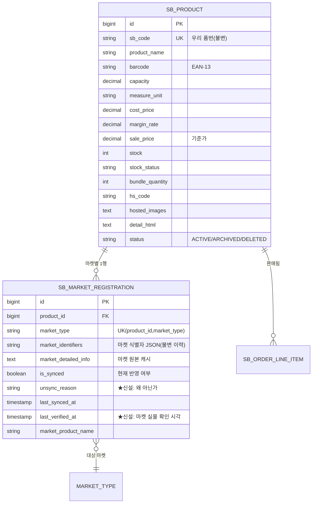
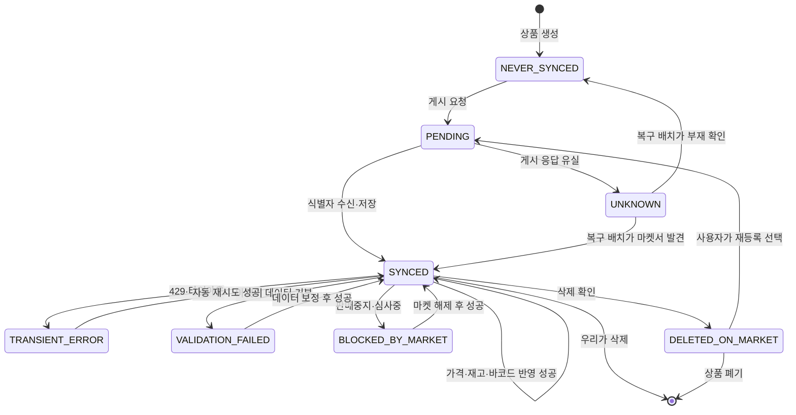
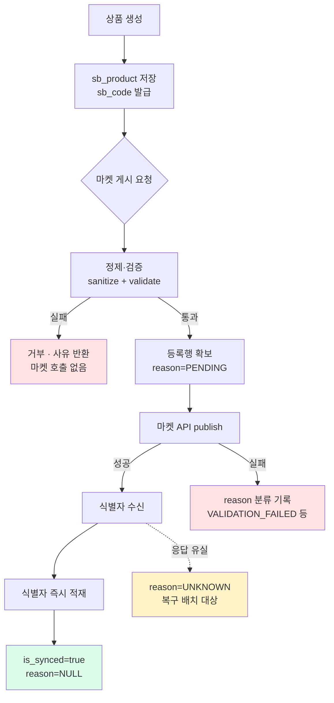
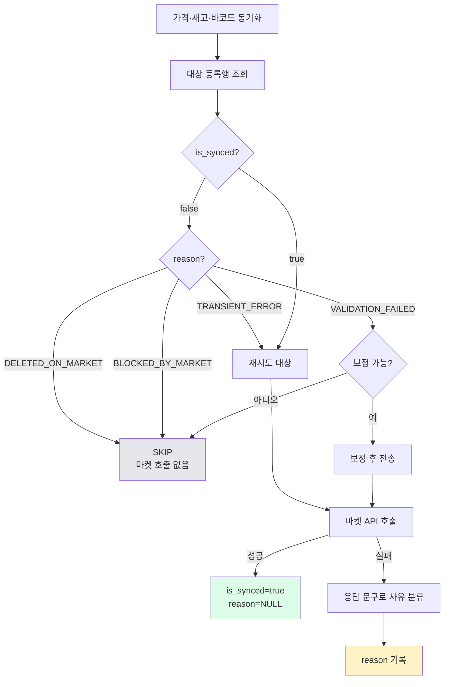
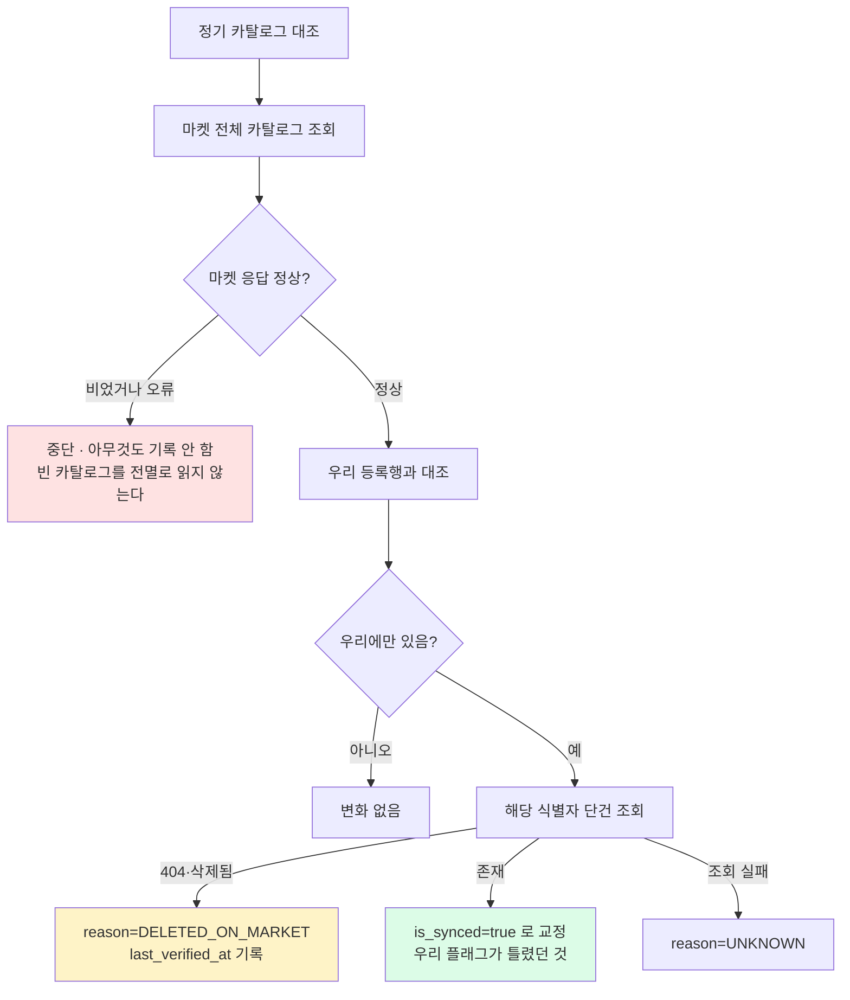
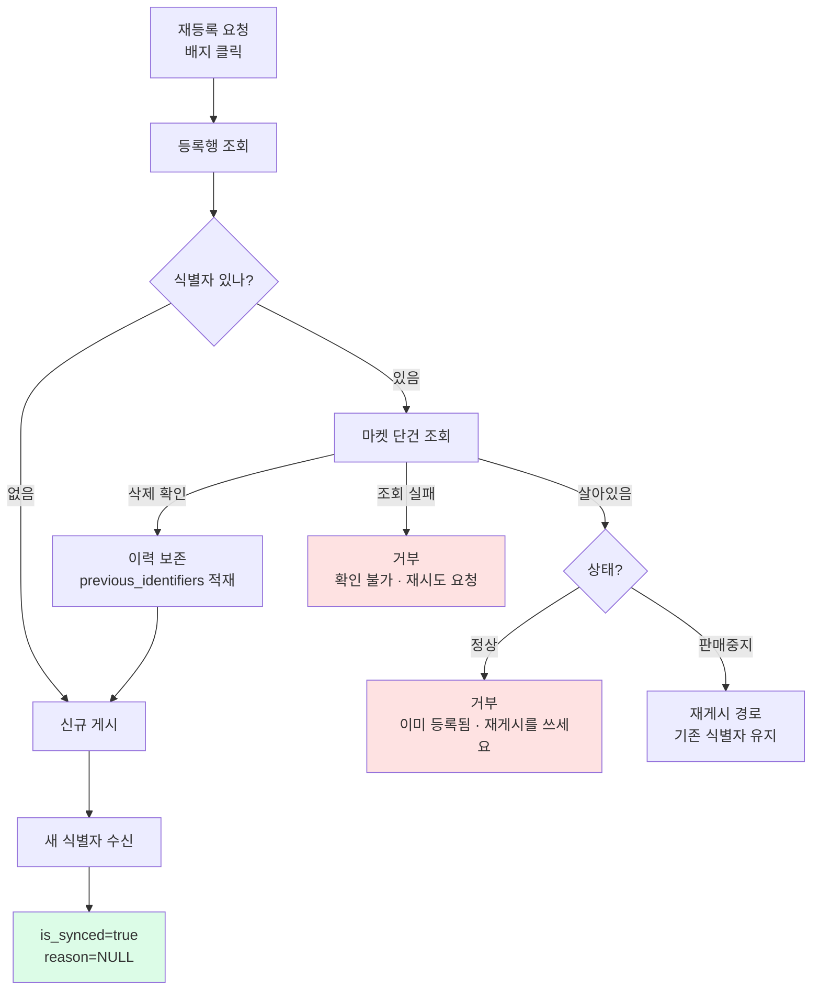
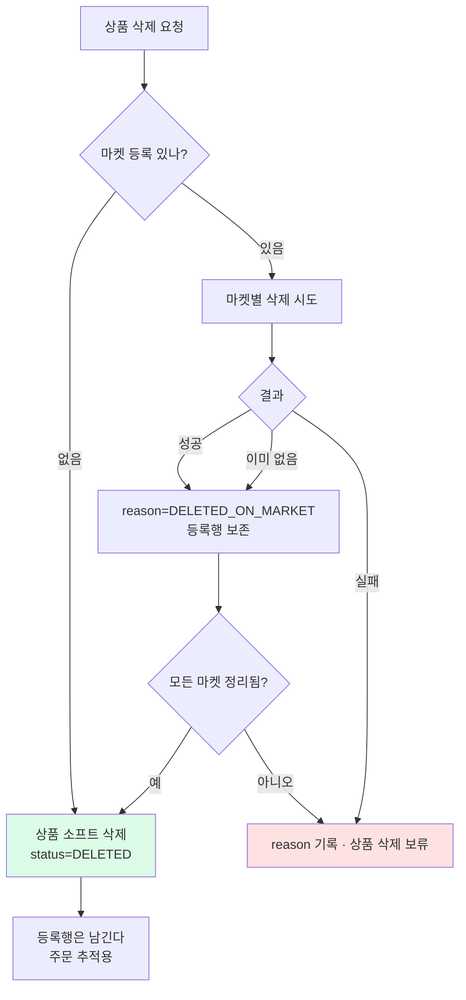
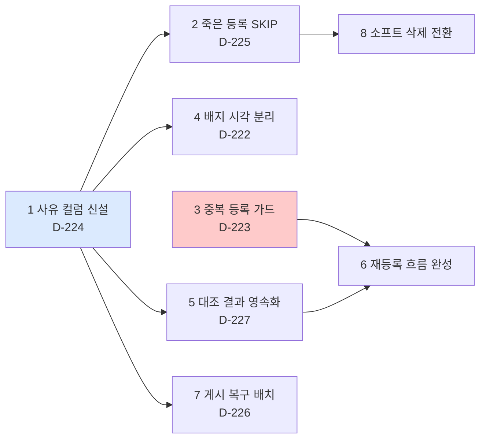

# 상품 생명주기 — 목표 아키텍처

작성 2026-08-29. [[product-lifecycle]] 이 **현재 무엇이 잘못됐는지**를 다뤘다면, 이 문서는 **고친 뒤 어떻게 흘러야 하는지**를 정의한다.

---

## 0. 설계 원칙 네 가지

이 문서의 모든 결정은 아래 네 문장에서 나온다.

**① 상태와 사유를 분리한다.**
"동기화됐는가"(boolean)와 "왜 안 됐는가"(enum)는 다른 정보다. 하나로 뭉치면 대응을 정할 수 없다.

**② 식별자는 지우지 않는다.**
마켓 상품번호는 과거 주문 추적·정합성 대조·이력의 근거다. 삭제된 리스팅의 번호도 남긴다. 지우면 문제가 사라지는 게 아니라 보이지 않게 된다.

**③ 쓰기 전에 존재를 확인한다.**
"우리 DB 가 그렇다고 하니까"로 마켓에 쓰지 않는다. 되돌리기 어려운 쓰기(신규 등록)일수록 마켓 실물을 먼저 조회한다.

**④ 모르면 모른다고 기록한다.**
조회 실패를 "없음"으로 단정하지 않는다. `UNKNOWN` 은 유효한 상태다.

---

## 1. 데이터 모델

### 1.1 ER 다이어그램



### 1.2 신설 컬럼 — `unsync_reason`

`is_synced=false` 하나에 뭉쳐 있던 상황을 갈라낸다.

| 값 | 의미 | 사용자에게 필요한 조치 | 자동 처리 |
|---|---|---|---|
| `NEVER_SYNCED` | 아직 한 번도 게시 안 됨 | 최초 등록 | 없음 |
| `PENDING` | 게시 요청 직후, 결과 미확정 | 대기 | 복구 배치가 화해 |
| `TRANSIENT_ERROR` | 429·타임아웃·순단 | 없음 | **자동 재시도** |
| `VALIDATION_FAILED` | 마켓이 데이터를 거부(고시정보 결손 등) | 데이터 수정 | 보정 가능하면 자동 |
| `DELETED_ON_MARKET` | 마켓에서 삭제 확인됨 | **재등록 결정** | 없음 (사람 판단) |
| `BLOCKED_BY_MARKET` | 판매중지·심사중·게이팅 | 마켓 문의 | 없음 |
| `UNKNOWN` | 조회 실패로 판정 불가 | 재확인 | 다음 대조에서 재판정 |

`is_synced=true` 이면 `unsync_reason` 은 항상 `NULL` 이다. 둘은 함께 갱신된다.

---

## 2. 상태 기계



**핵심**: `DELETED_ON_MARKET` 에서 `SYNCED` 로 가는 화살표가 **없다.** 삭제된 리스팅은 되살아나지 않는다. 반드시 `PENDING`(재등록)을 거친다.

---

## 3. 흐름 ① 신규 상품 등록



**지금과 달라지는 점**
- 실패 시 사유를 **분류해서** 기록한다(지금은 `false` 하나).
- 응답 유실 구간을 `UNKNOWN` 으로 명시하고 복구 배치가 처리한다(지금은 로그만).

---

## 4. 흐름 ② 정기 동기화 — 죽은 등록을 건드리지 않는다



**응답 문구 → 사유 매핑** (마켓별로 확정해 표로 관리한다)

| 마켓 | 응답 | 사유 |
|---|---|---|
| 쿠팡 | `이미 삭제된 상품입니다` | `DELETED_ON_MARKET` |
| 쿠팡 | `심사가 진행중입니다` | `BLOCKED_BY_MARKET` |
| 쿠팡 | `유효하지 않은 구매 옵션 값` | `VALIDATION_FAILED` |
| 스토어 | `400 BAD_REQUEST` + invalidInputs | `VALIDATION_FAILED` |
| 스토어 | `429 GW.RATE_LIMIT` | `TRANSIENT_ERROR` |
| 공통 | 타임아웃·5xx | `TRANSIENT_ERROR` |
| 공통 | **위 어디에도 안 맞음** | `UNKNOWN` ← 단정하지 않는다 |

---

## 5. 흐름 ③ 삭제 감지 — 능동 대조



**두 겹 확인이 핵심이다.** 카탈로그에 없다는 것만으로 삭제로 단정하지 않고 **단건 조회로 확증**한다. 페이징 누락·필터 차이로 카탈로그에서 빠질 수 있기 때문이다.

`persist=true` 옵션에서만 DB 에 쓴다. 기본은 읽기 전용 리포트를 유지한다.

---

## 6. 흐름 ④ 재등록 — 중복을 만들지 않는다



**지금과 결정적으로 달라지는 점**

지금은 살아있는 상품에 재등록을 걸면 **마켓에 중복 리스팅이 생기고 기존 식별자를 잃는다**(D-223). 목표 흐름은 **마켓 실물을 먼저 확인**해서:

- 살아있고 정상 → **거부**. 재게시를 쓰라고 안내
- 살아있고 판매중지 → **재게시**로 우회(새로 만들지 않는다)
- 삭제 확인 → 기존 식별자를 이력에 남기고 신규 게시
- 조회 실패 → **거부**. 모르는 상태로 쓰지 않는다(원칙 ③④)

식별자 이력은 `market_identifiers` 안에 `previous` 배열로 누적한다. 별도 테이블 없이:
```json
{"sellerProductId":"11583638672",
 "previous":[{"sellerProductId":"11400000001","deletedAt":"2026-03-01"}]}
```

---

## 7. 흐름 ⑤ 상품 폐기



**지금과 달라지는 점**

지금은 `deleteWithRegistrations` 가 등록행을 `deleteAll` 로 **완전 제거**하고 상품도 지운다. 그러면 **과거 주문이 참조할 식별자가 사라진다** — D-218 오배송 사고가 상품 매칭 실패에서 나온 것을 생각하면 위험하다.

목표는 **소프트 삭제**다. 상품은 `status=DELETED`, 등록행은 사유만 바꿔 보존한다. 주문·정산이 끝난 뒤 별도 보존기간 정책으로 정리한다.

---

## 8. 화면 표현

배지는 **사유별로 갈라 보여준다.** 지금은 `pending` 과 `registered` 가 시각적으로 구분되지 않아 삭제된 상품이 정상처럼 보인다(D-222).

| 상태 | 배지 | 클릭 동작 |
|---|---|---|
| `SYNCED` + URL | 진한 색 + 링크 | 마켓 상품 페이지 |
| `SYNCED` (링크 없음) | 진한 색 | 없음 |
| `DELETED_ON_MARKET` | **빨강 + 취소선** | **재등록 확인 다이얼로그** |
| `BLOCKED_BY_MARKET` | 주황 + 자물쇠 | 사유 툴팁 |
| `VALIDATION_FAILED` | 주황 + 경고 | 실패 필드 툴팁 |
| `TRANSIENT_ERROR` | 회색 + 시계 | 재시도 버튼 |
| `NEVER_SYNCED` / 행 없음 | 흐림 | 최초 등록 |
| `UNKNOWN` | 회색 + 물음표 | 재확인 버튼 |

한 화면에서 **"이 상품이 어느 마켓에 살아있고, 어디는 왜 안 되는지"** 가 읽혀야 한다.

---

## 9. 현재 → 목표 이행 순서



| 단계 | 내용 | 선행 | 위험 | 효과 |
|---|---|---|---|---|
| 1 | `unsync_reason` 컬럼 + 분류 로직 | 수동 DDL | 낮음 | 모든 후속의 전제 |
| 2 | 죽은 등록 전송 SKIP | 1 | 낮음 | 즉효 · 호출 낭비 제거 |
| 3 | 재등록 중복 가드 | 없음 | 낮음 | **피해 최대 항목 차단** |
| 4 | 배지 사유별 표시 | 1 | 낮음 | 운영 가시성 |
| 5 | 카탈로그 대조 영속화 | 1 | 중간 | 삭제 자동 감지 |
| 6 | 재등록 흐름 완성 | 3·5 | 중간 | 이력 보존 재등록 |
| 7 | 게시 복구 배치 | 1 | 중간 | 유실 구간 해소 |
| 8 | 소프트 삭제 전환 | 2 | **높음** | 주문 추적 보존 |

**3번은 선행이 없다.** 지금 당장 착수 가능하고 피해가 가장 크니 1번과 병행할 만하다.
**8번은 신중히 간다.** 기존 삭제 동작을 바꾸는 것이라 보존기간 정책을 먼저 정해야 한다.

---

## 10. 이 설계가 막는 실제 사고

| 사고 | 현재 | 목표에서 |
|---|---|---|
| 삭제된 쿠팡 상품에 바코드 전송(64건 실패) | `false` 를 안 보고 전송 | 2단계에서 SKIP |
| 재등록으로 유령 리스팅 생성 | 가드 없음 | 3단계에서 거부 |
| 배지가 켜져 삭제 상품을 못 알아봄 | 시각 미분리 | 4단계에서 빨강 표시 |
| 소비기한 결손 10건이 방치됨 | `false` 로만 남아 원인 불명 | `VALIDATION_FAILED` 로 즉시 식별 |
| D-210 "우리에만 101건" 이 매번 휘발 | 읽기 전용 | 5단계에서 기록 |
| 주문 추적용 식별자 유실 위험 | 하드 삭제 | 8단계 소프트 삭제 |

---

## 부록 — 마켓별 지원 현황 (2026-08-29 실측)

| 마켓 | 등록 | 가격·재고 | 바코드 | 삭제 | 비고 |
|---|---|---|---|---|---|
| 쿠팡 | O | O | **O** | O | 바코드는 승인필요 PUT |
| 스마트스토어 | O | O | **O** | O | `sellerCodeInfo.sellerBarcode` |
| 카페24 | O | O | **X** | O | 바코드 미지원(단일상품 422) |
| 11번가 | O | O | **X** | O | 플랫폼에 바코드 개념 없음 |
| G마켓·옥션 | **X** | X | X | X | 마켓플러스 경유만 |

바코드 상세는 [[barcode-market-push]], 현재 결함은 [[product-lifecycle]] 참조.
